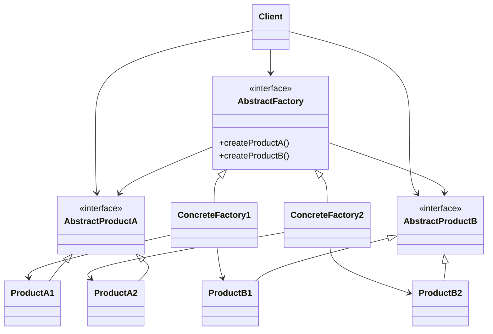
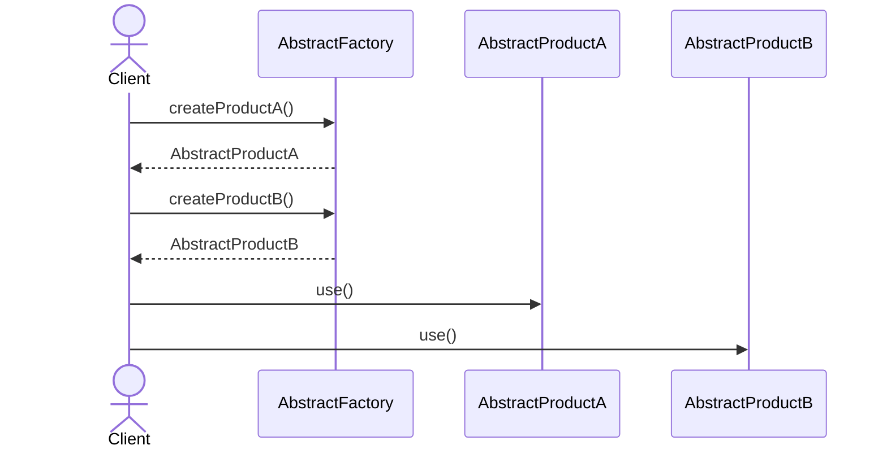

# Abstract Factory Pattern

## 📋 Overview

The **Abstract Factory** pattern - Provides an interface for creating families of related or dependent objects without specifying their concrete classes.

---

## 🎯 Intent

**Problem Solved:**

- You need to create families of related objects while ensuring they work together correctly; switch between families without modifying client code.

**Use When:**

- Your system needs multiple families of related products
- Ensure only compatible family members are used
- Switch between product families dynamically

---

## 👥 Roles & Responsibilities

| Role | Responsibility |
|------|-----------------|
| AbstractFactory |  Interface for creating products |
| ConcreteFactory |  Implements product creation |
| AbstractProduct |  Product interface |
| ConcreteProduct |  Concrete implementations |

---

## 💡 Code Example

```java
// Abstract Factory
public interface KingdomFactory {
    Castle createCastle();
    King createKing();
    Army createArmy();
}

// Concrete Factories
public class ElfKingdomFactory implements KingdomFactory {
    public Castle createCastle() { return new ElfCastle(); }
    public King createKing() { return new ElfKing(); }
    public Army createArmy() { return new ElfArmy(); }
}

public class DwarfKingdomFactory implements KingdomFactory {
    public Castle createCastle() { return new DwarfCastle(); }
    public King createKing() { return new DwarfKing(); }
    public Army createArmy() { return new DwarfArmy(); }
}

// Usage
KingdomFactory factory = new ElfKingdomFactory();
Castle castle = factory.createCastle();
```

**Reasoning:** Client code doesn't know concrete classes. Entire family changes by swapping factory. Ensures type-safe product combinations.

---

## 🔀 Design Principles

- **Dependency Inversion**
- **Single Responsibility**
- **Open/Closed Principle**

---

## 📊 Class Diagram



---

## 🔄 Sequence Diagram



---

## ⚖️ Trade-offs

### Advantages ✅

- Isolates client from concrete classes
- Ensures consistency among related products
- Easy to swap product families
- Centralizes product creation logic

### Disadvantages ❌

- More interfaces/classes required
- Complex hierarchy
- Adding new product type affects all factories
- Overkill for simple scenarios

---

## 🚫 When NOT to Use

- When simpler solutions suffice
- When adding unnecessary complexity
- In performance-critical paths (if it introduces overhead)

---

## ⚠️ Common Anti-Patterns

| Anti-Pattern | Issue | Solution |
|--------------|-------|----------|
| Factory returns null | use Optional | Use appropriate implementation |
| Leaky abstractions | stick to interfaces | Use appropriate implementation |
| Single Responsibility violation | separate concerns | Use appropriate implementation |

---

## 🌍 Real-World Use Cases

- Swing/AWT UI frameworks
- Database drivers (MySQL, Postgres)
- Cross-platform theme factories
- Java Collections framework factories

---

## 🔗 Alternatives & Similar Patterns

| Alternative | When to Use |
|-------------|------------|
| Factory Method | When... |
| Builder | When... |
| Prototype | When... |

---

## 📝 Best Practices

1. Keep the pattern simple and focused
2. Document pattern usage in code
3. Avoid overusing patterns
4. Test pattern implementations thoroughly
5. Consider performance implications
6. Make patterns explicit in architecture
7. Provide clear examples
8. Review patterns periodically

---

## 🎓 Related Patterns

- Gang of Four patterns
- Enterprise Integration Patterns
- Architectural Patterns

---

## 📚 References

- Gang of Four Design Patterns
- Effective Java (Joshua Bloch)
- Design Patterns in Java
- Refactoring Guru Design Patterns
