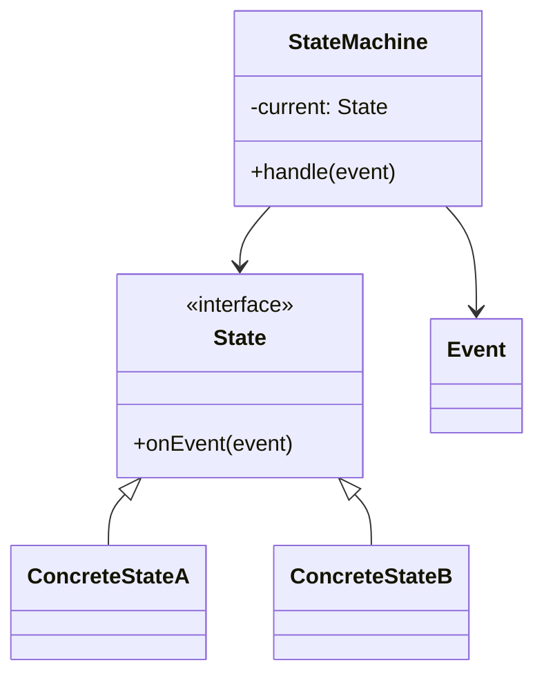
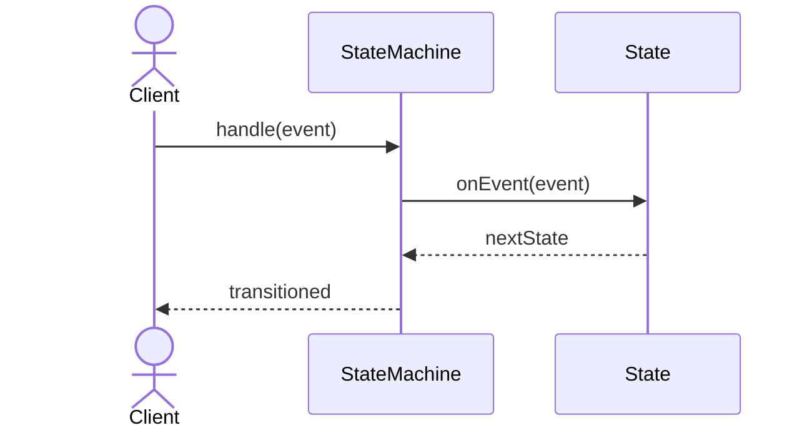

# State Machine Pattern

## 📋 Overview

The **State Machine** pattern models complex workflows and state transitions using explicit state objects and transitions.

---

## 🎯 Intent

**Problem Solved:**
- Model complex workflows with multiple states
- Manage state transitions
- Enforce valid state transitions
- Handle state-dependent behavior

---

## 👥 Roles & Responsibilities

| Role | Responsibility |
|------|-----------------|
| State | Defines state interface |
| ConcreteState | Implements state-specific behavior |
| StateMachine | Context managing states |

---

## 💡 Implementation

- States define valid transitions
- Transitions are explicit
- State machine validates transitions
- Prevents invalid state combinations

---

## 📊 Class Diagram

---

## 🔄 Sequence Diagram

---

## ⚖️ Trade-offs

### Advantages ✅
- Clear state modeling
- Enforced valid transitions
- Easy to visualize workflow
- Prevents illegal states
- Maintainable complex workflows

### Disadvantages ❌
- Increased complexity
- Many state classes
- Overhead for simple cases
- State explosion risk
- Difficult to modify existing states

---

## 🌍 Real-World Use Cases

- Workflow engines
- Protocol implementations
- Game state management
- Order processing
- TCP connection states

---

## 📚 References

- State Machine design
- Workflow patterns
