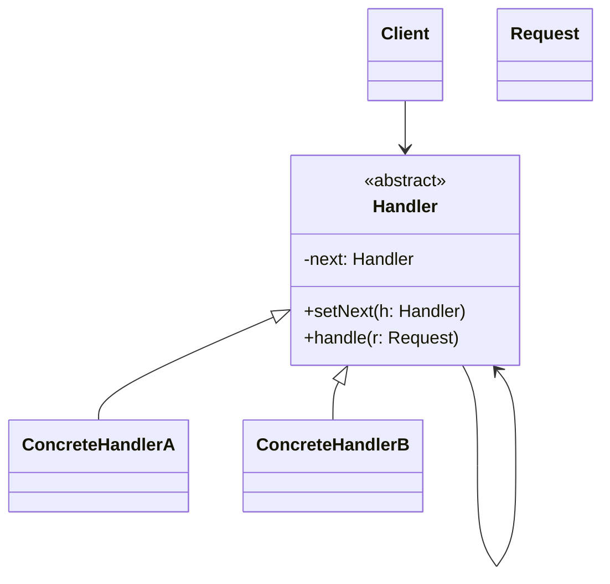
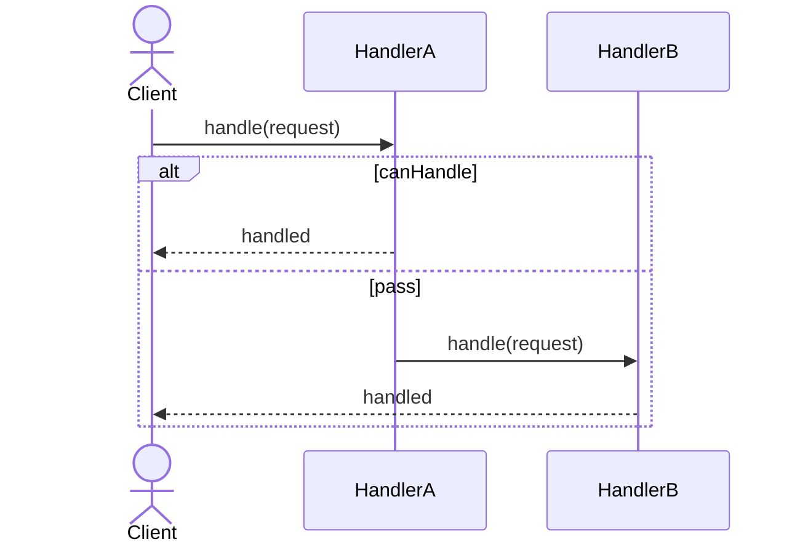

# Chain of Responsibility Pattern

## 📋 Overview

The **Chain of Responsibility** pattern passes a request along a chain of handlers. Each handler decides either to process the request or pass it to the next handler in the chain.

---

## 🎯 Intent

**Problem Solved:**
- You need to process a request by multiple handlers without knowing which handler will process it in advance
- You want to decouple the sender of a request from its receiver
- You want to allow adding/removing handlers dynamically

**Use When:**
- Multiple objects may handle a request
- You don't know in advance which object should handle the request
- You want to issue a request to multiple handlers without specifying the receiver explicitly

---

## 👥 Roles & Responsibilities

| Role | Responsibility |
|------|-----------------|
| Handler | Defines interface for handling requests and linking handlers |
| ConcreteHandler | Handles requests or passes them to next handler |
| Client | Initiates request into the chain |

---

## 💡 Code Example

```java
public abstract class RequestHandler {
    protected RequestHandler nextHandler;
    
    public void setNextHandler(RequestHandler nextHandler) {
        this.nextHandler = nextHandler;
    }
    
    public abstract void handleRequest(Request request);
}

public class ConcreteHandler extends RequestHandler {
    @Override
    public void handleRequest(Request request) {
        if (canHandle(request)) {
            process(request);
        } else if (nextHandler != null) {
            nextHandler.handleRequest(request);
        }
    }
    
    private boolean canHandle(Request request) {
        return request.getType() == RequestType.TYPE_A;
    }
    
    private void process(Request request) {
        System.out.println("Processing request: " + request);
    }
}

// Usage
RequestHandler handler1 = new ConcreteHandler();
RequestHandler handler2 = new ConcreteHandler();
handler1.setNextHandler(handler2);
handler1.handleRequest(new Request(RequestType.TYPE_A));
```

**Reasoning:** Decouples sender from receiver; handlers decide whether to handle or pass on request dynamically.

---

## 🔀 Design Principles

- **Dependency Inversion Principle**
- **Single Responsibility Principle**
- **Open/Closed Principle**

---

## 📊 Class Diagram



---

## 🔄 Sequence Diagram



---


## ⚖️ Trade-offs

### Advantages ✅
- Decouples sender from receiver
- Dynamic handler assignment
- Easy to add/remove handlers
- Multiple handlers can process request
- Flexible request handling

### Disadvantages ❌
- Request may not be handled
- Debugging difficult with long chains
- Performance impact with many handlers
- Chain configuration complexity
- Potential circular references

---

## 🚫 When NOT to Use

- Simple sequential processing
- One handler always handles the request
- Performance-critical applications
- Clear handler hierarchy exists

---

## ⚠️ Common Anti-Patterns

| Anti-Pattern | Problem | Solution |
|--------------|---------|----------|
| Infinite Loops | Circular chain references | Prevent circular chains |
| Silent Failures | Request disappears without handling | Always handle or log |
| God Handler | Handler does too much | Split into multiple handlers |

---

## 🌍 Real-World Use Cases

- Event handling in GUI frameworks
- Exception handling in Java
- Servlet filters in web frameworks
- Logging frameworks with appender chains
- Authorization/authentication pipelines

---

## 📝 Best Practices

1. Define clear handler contract
2. Document chain behavior
3. Handle unprocessed requests
4. Avoid infinite loops in chain
5. Keep handlers focused
6. Consider handler ordering
7. Log at each stage
8. Provide default handler

---

## 📚 References

- Gang of Four Design Patterns
- Effective Java (Joshua Bloch)
- Design Patterns in Java
