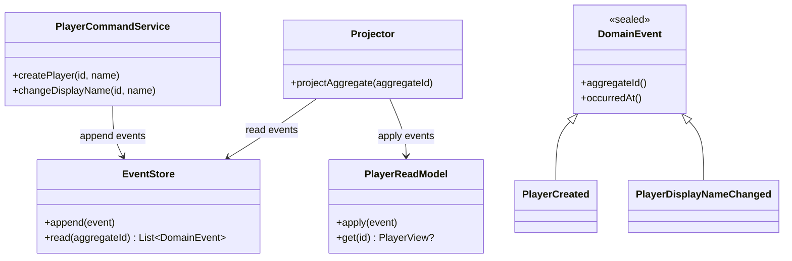
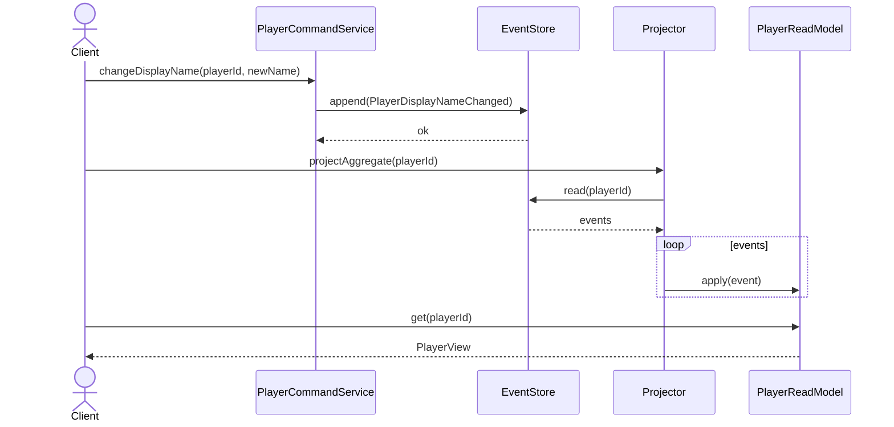

# CQRS Pattern (Command Query Responsibility Segregation)

## 📋 Overview

**CQRS** separates the **write model** (commands) from the **read model** (queries).
Writes typically emit **events**; reads are served from a projection optimized for queries.

An example: player profile writes (rename) emit events; profile reads come from a query store.

---

## 🎯 Intent

- Scale reads independently from writes
- Keep write-side rules strict while read-side stays fast and flexible
- Enable event-driven projections and eventually consistent read models

---

## 💡 Code Example

```java
commands.createPlayer("player-42", "RogueMage");
commands.changeDisplayName("player-42", "RogueMage_2");

projector.projectAggregate("player-42");
var view = readModel.get("player-42").orElseThrow();
```

---

## 📊 Class Diagram



---

## 🔄 Sequence Diagram



---

## ⚖️ Trade-offs

### Advantages ✅

- Great for read-heavy systems (leaderboards, profiles)
- Clear separation of concerns
- Works naturally with event sourcing (optional)

### Disadvantages ❌

- Eventual consistency between write and read sides
- Projection code becomes part of your critical path
