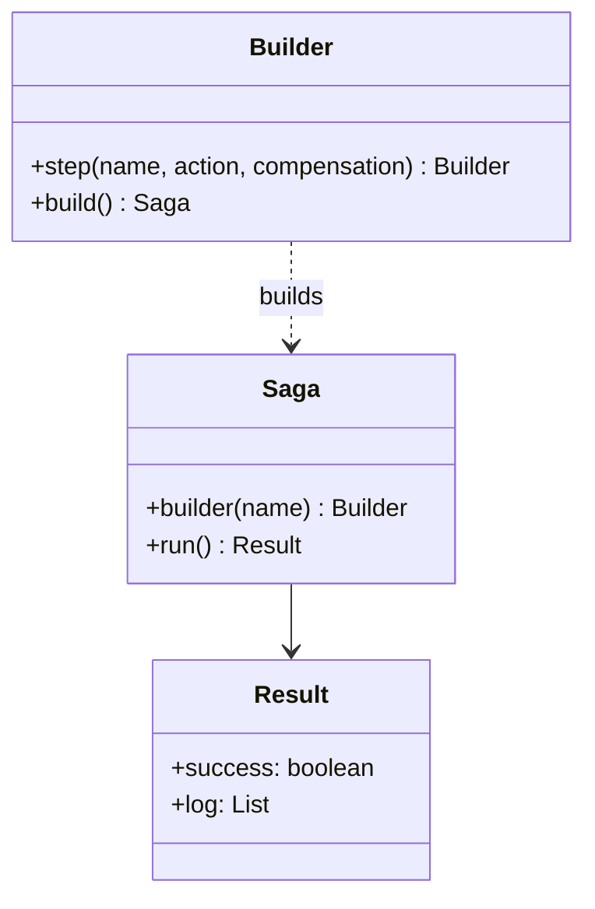
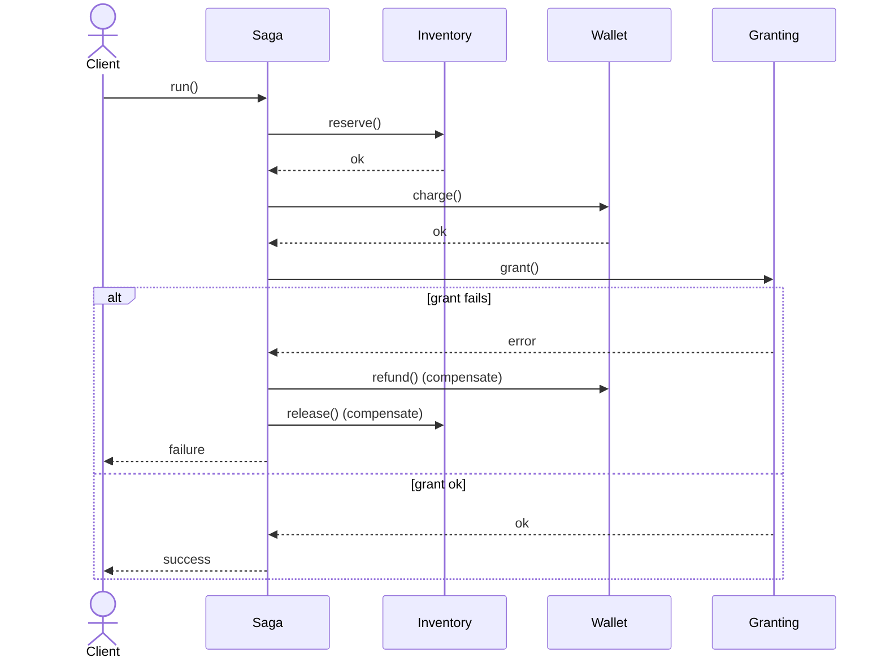

# Saga Pattern

## 📋 Overview

The **Saga** pattern manages a long-running business transaction across multiple services by splitting it into **steps**.
Each step has an optional **compensation** that undoes the work if a later step fails.

An example: buying a legendary item may touch **inventory**, **wallet**, and **granting** services.

---

## 🎯 Intent

- Replace distributed transactions (2PC) with **explicit orchestration + compensations**
- Make partial failure handling intentional and testable

---

## 💡 Code Example

```java
Saga saga = Saga.builder("purchase-legendary-sword")
    .step("reserve-inventory", reserve, release)
    .step("charge-wallet", charge, refund)
    .step("grant-item", grant, revoke)
    .build();

Saga.Result result = saga.run();
```

---

## 📊 Class Diagram



---

## 🔄 Sequence Diagram



---

## ⚖️ Trade-offs

### Advantages ✅
- Works well with microservices and async messaging
- Handles partial failures without global locks
- Encourages explicit recovery design

### Disadvantages ❌
- Compensations are not always perfect (undo may be best-effort)
- Requires careful modeling of state and retries/timeouts
