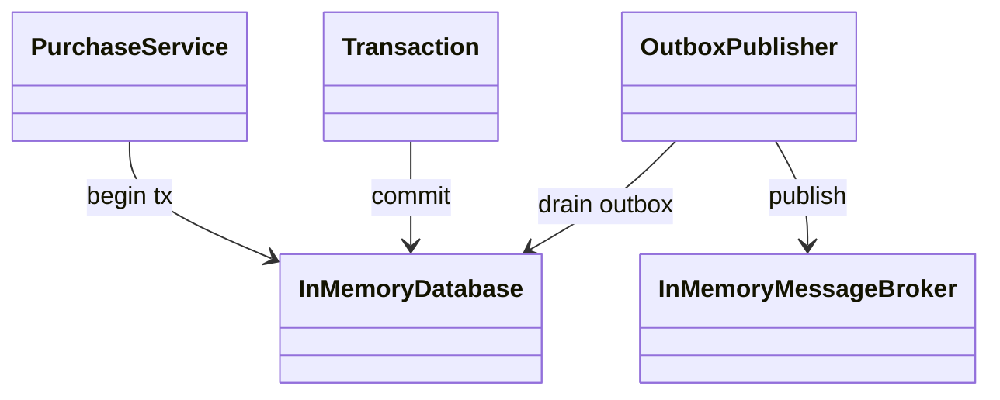
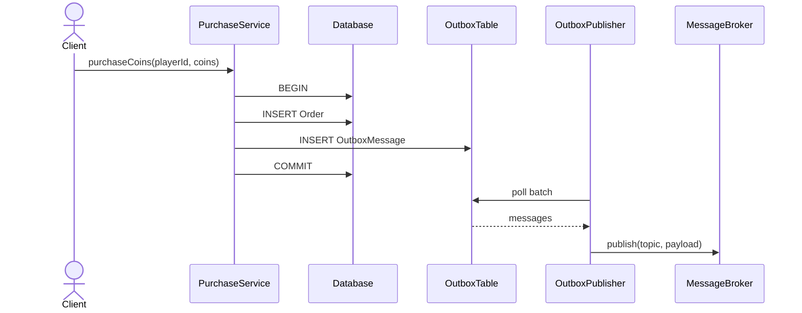

# Transactional Outbox Pattern

## 📋 Overview

The **Transactional Outbox** pattern ensures that when your service writes domain data, it also writes the integration event to an **outbox table** in the **same database transaction**.
A separate publisher later reads the outbox and publishes events to a broker.

An example: buying coins writes an order + emits `coins.purchased` without losing events during crashes.

---

## 🎯 Intent

- Prevent “write succeeded but event publish failed” inconsistencies
- Ensure at-least-once publication with a recoverable outbox

---

## 💡 Code Example

```java
var tx = db.begin();
tx.insertOrder(playerId, coins);
tx.addOutbox("coins.purchased", jsonPayload);
tx.commit();

publisher.publishOnce(100);
```

---

## 📊 Class Diagram



---

## 🔄 Sequence Diagram



---

## ⚖️ Trade-offs

### Advantages ✅
- Strong consistency between domain write and event record
- Simple recovery: publish from outbox after restart

### Disadvantages ❌
- Requires polling/streaming outbox and operational tooling
- Needs idempotent publishing/consumers (at-least-once)
