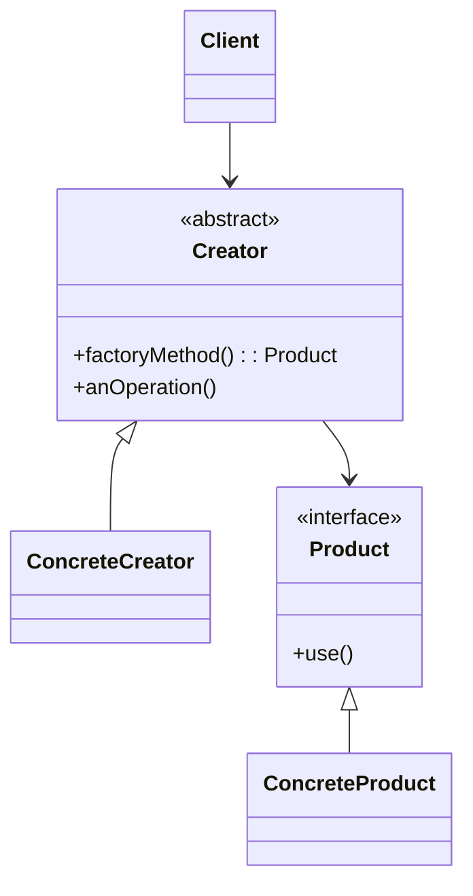
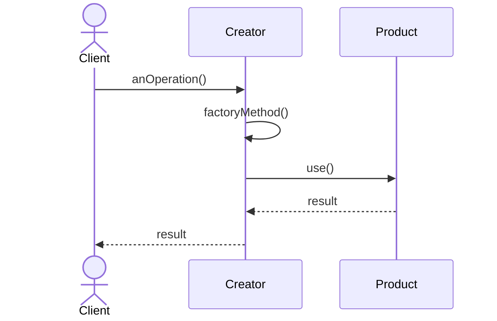

# Factory Method Pattern

## 📋 Overview

The **Factory Method Pattern** defines an interface for creating an object, letting subclasses decide which class to instantiate.

---

## 🎯 Intent

**Problem Solved:**
- You need to create objects but don't know the concrete class until runtime
- You want subclasses to specify the objects they create
- Object creation logic should be separate from usage

**Use When:**
- A class cannot anticipate the type of objects it needs to create
- You want subclasses to specify the objects they create
- Object creation logic should be separate from business logic

---

## 👥 Roles & Responsibilities

| Role | Responsibility |
|------|-----------------|
| Creator | Declares factory method; may provide default implementation |
| ConcreteCreator | Overrides factory method to create specific product |
| Product | Declares interface for objects |
| ConcreteProduct | Implements product interface |

---

## 💡 Code Example

```java
// Product Interface
public interface Transport {
    void deliver(String cargo);
}

// Concrete Products
public class Truck implements Transport {
    @Override
    public void deliver(String cargo) {
        System.out.println("Truck delivering: " + cargo);
    }
}

// Creator (Abstract)
public abstract class Logistics {
    abstract Transport createTransport();
    
    public void planDelivery(String cargo) {
        Transport transport = createTransport();
        transport.deliver(cargo);
    }
}

// Concrete Creator
public class RoadLogistics extends Logistics {
    @Override
    Transport createTransport() {
        return new Truck();
    }
}

// Usage
Logistics logistics = new RoadLogistics();
logistics.planDelivery("Package");
```

**Reasoning:** Clients depend on abstractions, not concrete classes. Subclasses decide what product to create. Promotes loose coupling and flexibility.

---

## 🔀 Design Principles

- **Dependency Inversion Principle:** Depend on abstractions
- **Open/Closed Principle:** New products without modifying Creator
- **Single Responsibility Principle:** Creator handles only creation logic

---

## 📊 Class Diagram



---

## 🔄 Sequence Diagram



---

## ⚖️ Trade-offs

### Advantages ✅
- Decouples creator from concrete products
- Encapsulates creation logic
- Easier to add new product types
- Cleaner code than multiple if-else branches

### Disadvantages ❌
- Creates subclass hierarchy just for creation
- Can be overkill for simple scenarios
- More complex than direct instantiation
- Multiple files for simple variations

---

## 🚫 When NOT to Use

- **Simple objects with straightforward creation** - Use direct instantiation
- **Single product type** - Unnecessary abstraction
- **Static factory methods sufficient** - Use static factories instead

---

## ⚠️ Common Anti-Patterns

| Anti-Pattern | Problem | Solution |
|--------------|---------|----------|
| Over-Abstracting | Creating factory for every object | Use only when creation logic is complex |
| Leaky Abstractions | Creator exposes product implementation | Keep abstractions strict |
| Mixing Responsibilities | Creator also validates/processes | Separate concerns |

---

## 🌍 Real-World Use Cases

- **Java Collections:** `List.of()`, `Set.of()`
- **SLF4J:** `LoggerFactory.getLogger()`
- **JDBC:** `DriverManager.getConnection()`
- **XML:** `DocumentBuilderFactory.newInstance()`

---

## 🔗 Alternatives & Similar Patterns

| Alternative | When to Use |
|-------------|------------|
| Abstract Factory | When managing families of related products |
| Builder | When object construction is complex |
| Prototype | When cloning is more efficient |

---

## 📝 Best Practices

1. Keep factory interface simple and intuitive
2. Avoid making factory methods do too much
3. Document expected exceptions
4. Provide clear naming for factory methods
5. Consider static factory methods for simplicity
6. Ensure thread-safety if needed
7. Validate inputs before creating objects
8. Provide sensible defaults where possible

---

## 🎓 Related Patterns

- Abstract Factory
- Builder Pattern
- Prototype Pattern
- Singleton Pattern

---

## 📚 References

- Gang of Four Design Patterns
- Effective Java (Joshua Bloch)
- Design Patterns in Java (Edith Freeman et al.)
