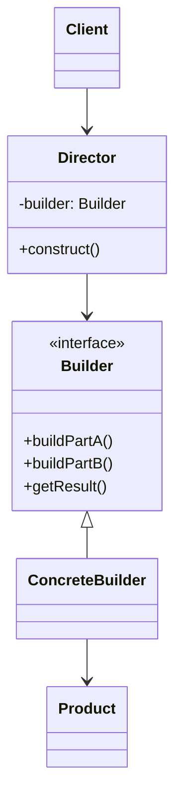
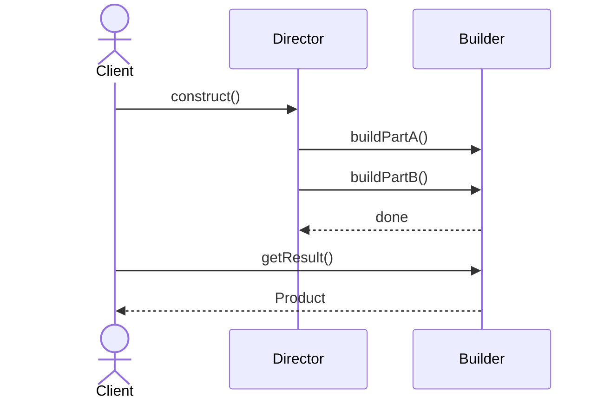

# Builder Pattern

## 📋 Overview

The **Builder Pattern** is a creational pattern that constructs complex objects step-by-step, separating the construction logic from the representation. It provides a fluent, readable interface for building objects with many optional parameters or complex initialization logic.

---

## 🎯 Intent

**Problem Solved:**
- Creating objects with many parameters is error-prone and produces unreadable code
- Objects have optional and mandatory parameters; telescoping constructors become unwieldy
- Complex initialization logic should be separated from object representation
- You need to construct immutable objects while maintaining readability

**Use When:**
- Objects have 3+ optional parameters
- You need to build immutable objects with validation
- Construction logic is complex or multi-step
- You want to improve code readability over constructor overloading

---

## 👥 Roles & Responsibilities

| Role | Responsibility |
|------|-----------------|
| **Product** | The complex object being constructed (e.g., Hero) |
| **Builder** | Abstract interface defining construction steps |
| **Concrete Builder** | Implements construction steps, accumulates result |
| **Director** | (Optional) Orchestrates the builder to construct products in a specific order |
| **Client** | Uses builder to construct products |

**Key Characteristics:**
- Fluent interface enabling method chaining
- Separation of construction from representation
- Step-by-step object assembly
- Validation at build stage

---

## 💡 Implementation Example

```java
// Product: Complex object to build
public class Hero {
    private final String name;
    private final Profession profession;
    private final HairType hairType;
    private final HairColor hairColor;
    private final Armor armor;
    private final Weapon weapon;

    private Hero(HeroBuilder builder) {
        this.name = builder.name;
        this.profession = builder.profession;
        this.hairType = builder.hairType;
        this.hairColor = builder.hairColor;
        this.armor = builder.armor;
        this.weapon = builder.weapon;
    }

    // Builder: Inner class managing construction
    public static class HeroBuilder {
        private final String name;
        private final Profession profession;
        private HairType hairType;
        private HairColor hairColor;
        private Armor armor;
        private Weapon weapon;

        // Mandatory parameters in constructor
        public HeroBuilder(Profession profession, String name) {
            this.profession = profession;
            this.name = name;
        }

        // Fluent methods for optional parameters
        public HeroBuilder withHairType(HairType hairType) {
            this.hairType = hairType;
            return this;
        }

        public HeroBuilder withHairColor(HairColor hairColor) {
            this.hairColor = hairColor;
            return this;
        }

        public HeroBuilder withArmor(Armor armor) {
            this.armor = armor;
            return this;
        }

        public HeroBuilder withWeapon(Weapon weapon) {
            this.weapon = weapon;
            return this;
        }

        // Build: Final step returning the constructed product
        public Hero build() {
            return new Hero(this);
        }
    }
}

// Usage: Clean, readable, chainable construction
Hero mage = new Hero.HeroBuilder(Profession.MAGE, "Merlin")
    .withHairColor(HairColor.BLACK)
    .withWeapon(Weapon.STAFF)
    .build();
```

**Reasoning:** 
- Separates object construction from its representation
- Fluent interface improves readability dramatically
- Mandatory parameters enforced in constructor
- Optional parameters via fluent methods
- Immutability achieved through private constructor

---

## 📊 Class Diagram



---

## 🔄 Sequence Diagram



---

## 🔀 Design Principles Emphasized

| Principle | How Applied |
|-----------|------------|
| **Single Responsibility** | Builder manages construction; Product manages data |
| **Separation of Concerns** | Object representation separated from construction logic |
| **Composition over Inheritance** | Builder uses composition to accumulate object state |
| **Fluent Interface** | Method chaining improves readability |
| **Immutability** | Constructor is private; object state set via builder |

---

## ⚖️ Trade-offs

### Advantages ✅
- **Improved Readability:** Fluent interface makes code self-documenting
- **Flexibility:** Easy to add/remove optional parameters without breaking code
- **Immutability:** Separating construction enables creation of immutable objects
- **Complex Initialization:** Handles multi-step construction elegantly
- **Mandatory Parameter Enforcement:** Constructor ensures required params are present
- **Validation:** Can validate at build stage before creating object

### Disadvantages ❌
- **Code Verbosity:** More classes and methods to maintain
- **Performance Overhead:** Creating builder object adds memory/GC pressure
- **Complexity for Simple Objects:** Overkill for objects with few parameters
- **Thread Safety:** Builder itself is not thread-safe; don't share across threads
- **Builder Proliferation:** Every complex class needs its own builder

---

## 🚫 When NOT to Use

| Scenario | Why Avoid |
|----------|-----------|
| **Simple Objects** | Objects with 1-2 parameters; use direct constructors |
| **Mutable Objects** | Builder is designed for immutability; doesn't benefit mutable objects |
| **Performance Critical** | Memory overhead of builder may matter in high-frequency scenarios |
| **All Parameters Optional** | If no mandatory parameters, builder doesn't enforce constraints |
| **Frequent Modification** | If object needs modification after creation, use setters instead |

---

## ⚠️ Common Anti-Patterns & Misuses

| Anti-Pattern | Problem | Solution |
|--------------|---------|----------|
| **Shared Builder Across Threads** | Race conditions when building concurrent products | Create new builder per thread; builders not thread-safe |
| **Builder Without Validation** | Invalid objects created if validation deferred | Implement validation in `build()` method |
| **All-Optional Builder** | No constraints on required parameters | Enforce mandatory params in builder constructor |
| **Complex Directors** | Director hides builder complexity instead of simplifying it | Director should orchestrate, not complicate |
| **Mutable Product After Build** | Product state modified after construction defeats builder purpose | Keep product immutable; add new builder if changes needed |
| **Builder with Setters** | Contradicts immutability goal | Use only fluent builder methods, no setters on product |

---

## 🌍 Real-World Use Cases

### Java StringBuilder
```java
// StringBuilder is a builder for immutable String
String text = new StringBuilder()
    .append("Hello")
    .append(" ")
    .append("World")
    .toString();
```

### Google Guava - ImmutableList
```java
// Guava uses builder for complex immutable collections
ImmutableList<String> list = ImmutableList.builder()
    .add("item1")
    .add("item2")
    .build();
```

### Lombok @Builder
```java
// Lombok annotation auto-generates builder
@Builder
public class User {
    private String name;
    private String email;
    private int age;
}

// Usage
User user = User.builder()
    .name("Alice")
    .email("alice@example.com")
    .age(30)
    .build();
```

### HTTP Clients (OkHttp)
```java
// OkHttp Request builder
Request request = new Request.Builder()
    .url("https://example.com")
    .addHeader("User-Agent", "MyApp")
    .post(body)
    .build();
```

### Apache Commons - Configuration
```java
// Configuration builder with fluent interface
Configuration config = new Configuration.Builder()
    .setDatabaseUrl("jdbc:mysql://localhost")
    .setMaxConnections(50)
    .setReadTimeout(5000)
    .build();
```

---

## 🔗 Alternatives & Similar Patterns

| Alternative | When to Prefer |
|-------------|-----------------|
| **Telescoping Constructor** | For simple objects with few parameters |
| **JavaBeans with Setters** | When mutability is acceptable; not ideal for immutability |
| **Factory Method** | For creating simple objects or choosing implementations |
| **Abstract Factory** | When building families of related objects |
| **Fluent Configuration** | Lightweight alternative to builder for configuration objects |

---

## 📝 Best Practices

1. **Enforce Mandatory Parameters:** Place required params in builder constructor
2. **Use Method Chaining:** Return `this` for fluent interface
3. **Validate in Build:** Check constraints before creating product
4. **Keep Builder Simple:** Avoid complex logic; delegate to product
5. **Consider Lombok:** Use `@Builder` annotation to auto-generate builder code
6. **Make Product Immutable:** Private constructor, final fields
7. **Document Optional Parameters:** Clarify defaults and constraints
8. **Provide Copy Constructor:** Allow building new instance from existing product

---

## 🎓 Related Patterns

- **Factory Pattern:** Can be used within builder to create complex sub-objects
- **Composite Pattern:** Builder often used to construct composite structures
- **Strategy Pattern:** Builder can use different strategies for object construction
- **Template Method:** Builder steps can follow a template structure

---

## 📚 References

- Gang of Four Design Patterns
- Effective Java (Joshua Bloch) - Item 2: Builder Pattern
- Google Guava Library
- Lombok @Builder Annotation
