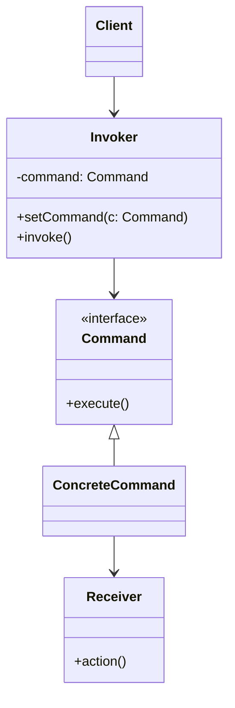
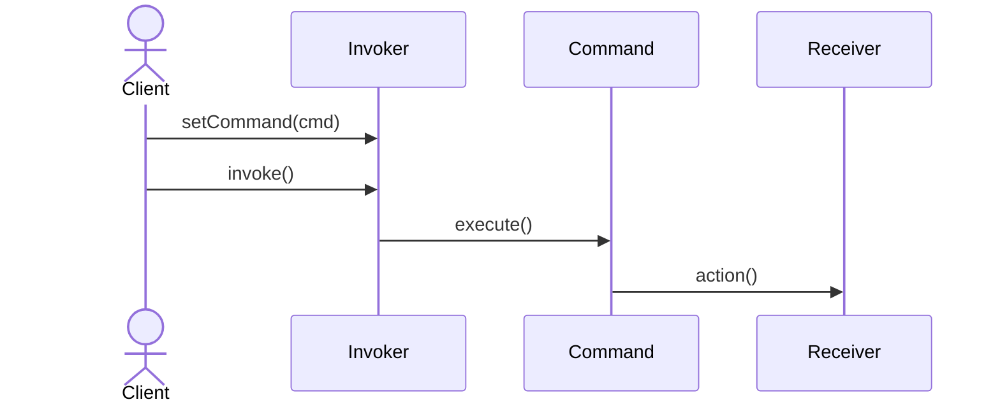

# Command Pattern

## 📋 Overview

The **Command** pattern encapsulates a request as an object, allowing parameterization of clients with different requests, queuing of requests, and logging of requests.

---

## 🎯 Intent

**Problem Solved:**
- Encapsulate a request as an object
- Decouple the object that invokes an operation from the one that performs it
- Allow undo/redo functionality
- Queue commands for deferred execution

---

## 👥 Roles & Responsibilities

| Role | Responsibility |
|------|-----------------|
| Command | Declares interface for executing operation |
| ConcreteCommand | Binds receiver to action |
| Receiver | Knows how to perform actual work |
| Invoker | Asks command to carry out request |
| Client | Creates ConcreteCommand |

---

## 💡 Code Example

```java
public interface Command {
    void execute();
    void undo();
}

public class LightOnCommand implements Command {
    private Light light;
    
    public LightOnCommand(Light light) {
        this.light = light;
    }
    
    @Override
    public void execute() {
        light.on();
    }
    
    @Override
    public void undo() {
        light.off();
    }
}

// Invoker
public class RemoteControl {
    private List<Command> commands = new ArrayList<>();
    
    public void pressButton(Command command) {
        command.execute();
        commands.add(command);
    }
    
    public void undo() {
        if (!commands.isEmpty()) {
            commands.remove(commands.size() - 1).undo();
        }
    }
}

// Usage
RemoteControl remote = new RemoteControl();
remote.pressButton(new LightOnCommand(light));
remote.undo();
```

**Reasoning:** Requests encapsulated as objects enabling queuing, undoing, and macro commands.

---

## 📊 Class Diagram



---

## 🔄 Sequence Diagram



---

## ⚖️ Trade-offs

### Advantages ✅
- Decouples invoker from receiver
- Easy to add new commands
- Supports undo/redo
- Can queue commands
- Supports command macros
- Deferred execution

### Disadvantages ❌
- More classes required
- Increased memory usage
- Complexity for simple operations
- Undo/redo state management
- Performance overhead

---

## 🌍 Real-World Use Cases

- GUI button actions
- Undo/redo functionality
- Task queuing systems
- Macro recording
- Transaction systems
- Remote procedure calls

---

## 📚 References

- Gang of Four Design Patterns
- Effective Java (Joshua Bloch)
