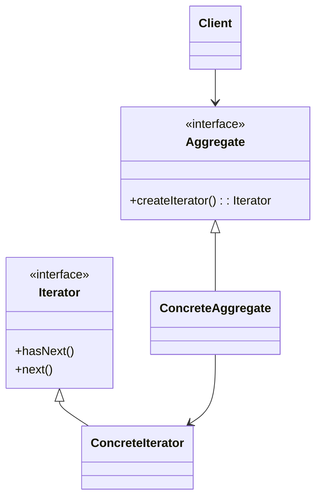
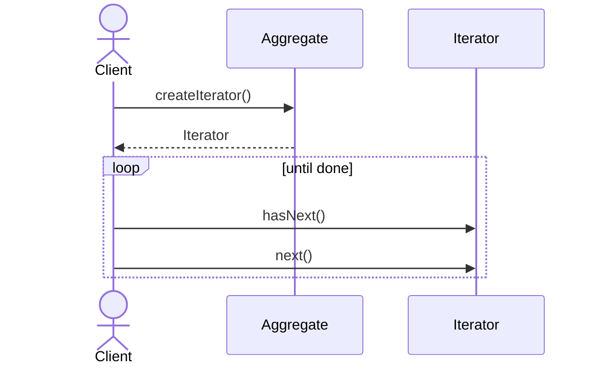

# Iterator Pattern

## 📋 Overview

The **Iterator** pattern provides a way to access elements of a collection sequentially without exposing its underlying representation.

---

## 🎯 Intent

**Problem Solved:**
- Access collection elements without exposing structure
- Support multiple simultaneous traversals
- Provide uniform interface for different collections
- Hide collection implementation details

---

## 👥 Roles & Responsibilities

| Role | Responsibility |
|------|-----------------|
| Iterator | Defines interface for traversal |
| ConcreteIterator | Implements traversal logic |
| Collection | Defines interface for creating iterator |
| ConcreteCollection | Returns ConcreteIterator |

---

## 💡 Implementation

Java's Iterator interface:
- hasNext(): Check if more elements
- next(): Get next element
- remove(): Remove current element

---

## 📊 Class Diagram

---

## 🔄 Sequence Diagram

---

## ⚖️ Trade-offs

### Advantages ✅
- Uniform traversal interface
- Hides collection structure
- Supports multiple iterations
- Decouples collection from traversal
- Different iteration strategies

### Disadvantages ❌
- Additional complexity
- Iterator overhead
- State management in iterator
- Concurrent modification issues
- Performance impact

---

## 🌍 Real-World Use Cases

- Java Collections Framework
- Database result set traversal
- File system traversal
- Tree/graph traversal
- Stream processing

---

## 📚 References

- Gang of Four Design Patterns
- Java Collections Framework
- Iterator design
