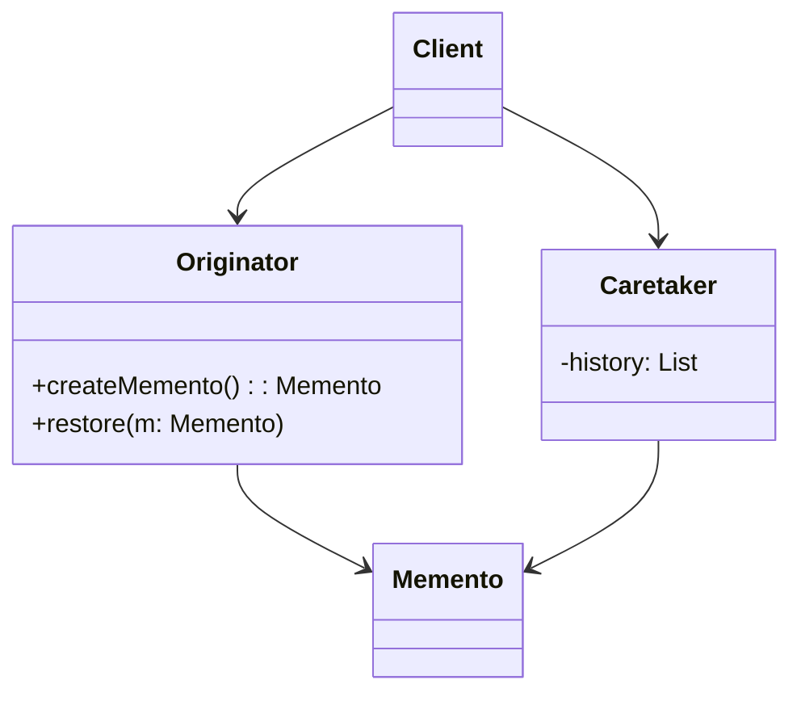
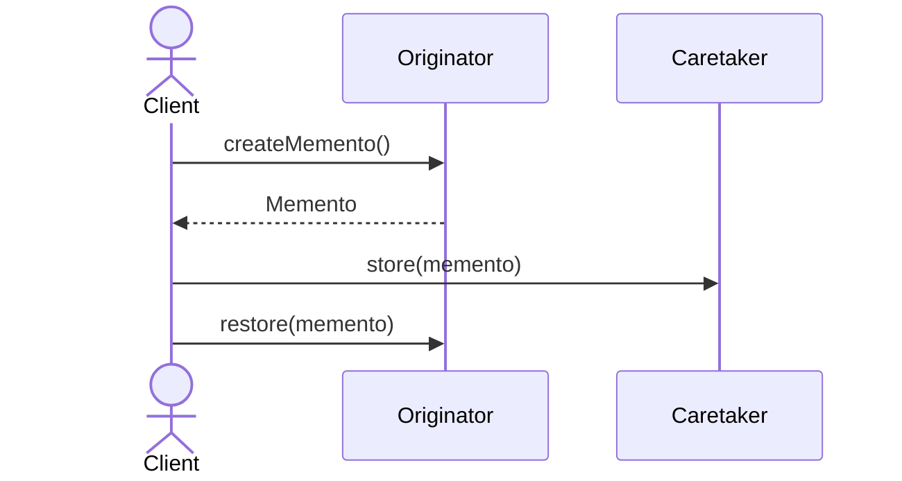

# Memento Pattern

## 📋 Overview

The **Memento** pattern captures and externalizes an object's internal state without violating encapsulation, and allows the object to be restored to this state later.

---

## 🎯 Intent

**Problem Solved:**
- Save and restore object state
- Implement undo/redo functionality
- Without exposing internal structure
- Without violating encapsulation

---

## 👥 Roles & Responsibilities

| Role | Responsibility |
|------|-----------------|
| Originator | Creates memento, uses memento to restore state |
| Memento | Stores state snapshot |
| Caretaker | Manages mementos |

---

## 💡 Implementation

- Memento stores state snapshot
- Originator creates/uses mementos
- Caretaker manages memento collection
- Enables state history management

---

## 📊 Class Diagram

---

## 🔄 Sequence Diagram

---

## ⚖️ Trade-offs

### Advantages ✅
- Encapsulation preserved
- Simple undo/redo
- State history management
- Serialization support
- Snapshot capability

### Disadvantages ❌
- Memory overhead
- Performance cost for large objects
- Serialization complexity
- State consistency management
- Storage requirements

---

## 🌍 Real-World Use Cases

- Text editor undo/redo
- Database transactions
- Game state saves
- Configuration snapshots
- Version control systems

---

## 📚 References

- Gang of Four Design Patterns
- State management patterns
