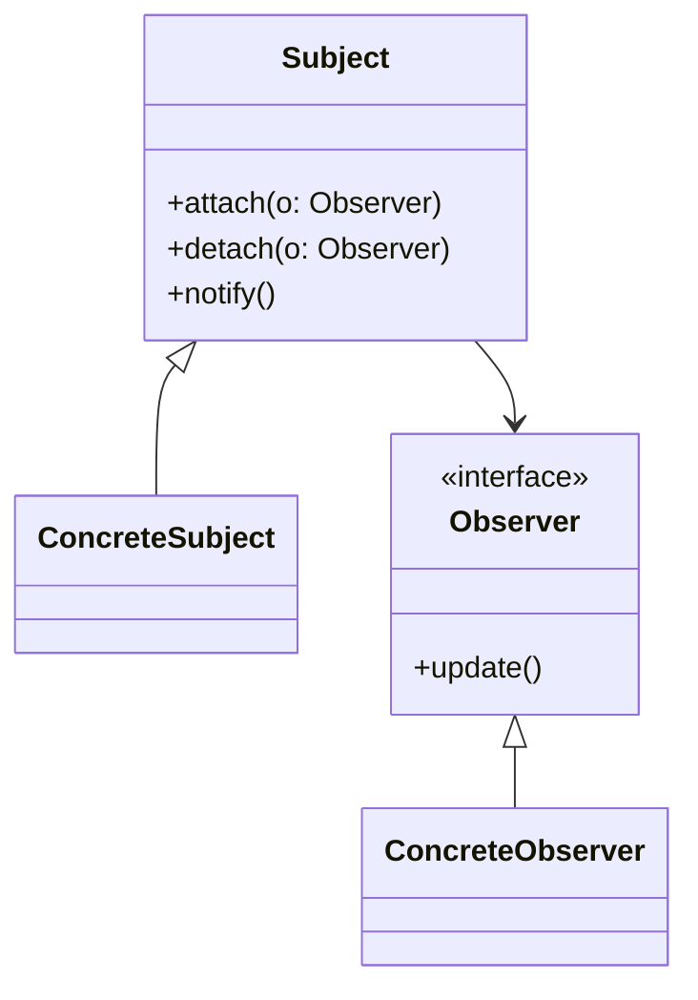
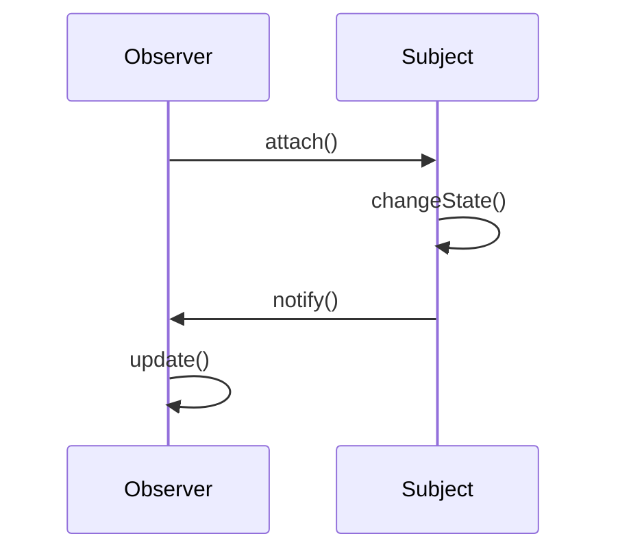

# Observer Pattern

## 📋 Overview

The **Observer** pattern defines a one-to-many dependency between objects so that when one object changes state, all its dependents are notified automatically.

---

## 🎯 Intent

**Problem Solved:**
- An object's state changes and other objects need to be notified
- Notify multiple objects without tight coupling
- Enable event-driven architecture

---

## 👥 Roles & Responsibilities

| Role | Responsibility |
|------|-----------------|
| Subject | Knows observers, provides interface to attach/detach |
| Observer | Defines interface for update notification |
| ConcreteObserver | Stores reference to Subject, implements update |
| ConcreteSubject | Stores state, sends notifications on change |

---

## 💡 Code Example

```java
public interface Observer {
    void update(String message);
}

public class Subject {
    private List<Observer> observers = new ArrayList<>();
    
    public void attach(Observer observer) {
        observers.add(observer);
    }
    
    public void detach(Observer observer) {
        observers.remove(observer);
    }
    
    public void notifyObservers(String message) {
        for (Observer observer : observers) {
            observer.update(message);
        }
    }
}

public class ConcreteObserver implements Observer {
    private String name;
    
    @Override
    public void update(String message) {
        System.out.println(name + " received: " + message);
    }
}

// Usage
Subject subject = new Subject();
Observer obs1 = new ConcreteObserver();
subject.attach(obs1);
subject.notifyObservers("Event occurred");
```

**Reasoning:** Loose coupling between Subject and Observers; enables dynamic subscription model.

---

## 📊 Class Diagram



---

## 🔄 Sequence Diagram



---

## ⚖️ Trade-offs

### Advantages ✅
- Loose coupling
- Dynamic observer management
- Supports broadcast communications
- Natural event handling
- Promotes reactive programming

### Disadvantages ❌
- Observer ordering unpredictable
- Memory overhead (observer references)
- Performance impact with many observers
- Difficult to trace event flow
- Can lead to memory leaks

---

## 🌍 Real-World Use Cases

- Event listeners in GUI frameworks
- Message passing systems
- Reactive programming libraries
- Model-View patterns
- Pub/Sub systems

---

## 📚 References

- Gang of Four Design Patterns
- Reactive Programming concepts
- Event-driven architecture
