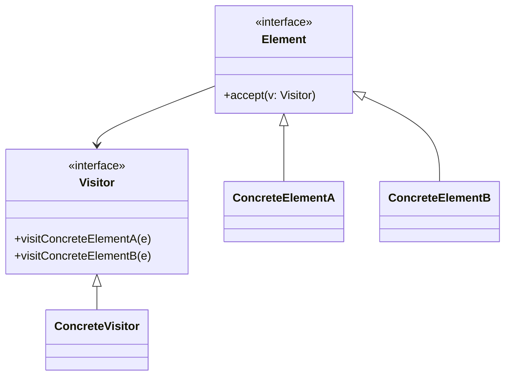
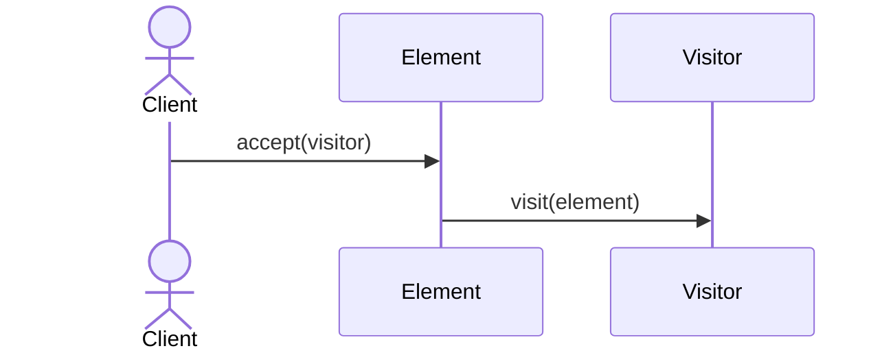

# Visitor Pattern

## 📋 Overview

The **Visitor** pattern represents an operation to be performed on elements of an object structure. It lets you define a new operation without changing the classes of the elements on which it operates.

---

## 🎯 Intent

**Problem Solved:**
- Perform operations on complex object structures without changing their classes
- Add new operations to class hierarchy without modification
- Operations are related but scattered across classes

---

## 👥 Roles & Responsibilities

| Role | Responsibility |
|------|-----------------|
| Visitor | Declares visit methods for each element type |
| ConcreteVisitor | Implements specific operations |
| Element | Accepts visitor |
| ConcreteElement | Implements accept method |
| ObjectStructure | Provides access to elements |

---

## 💡 Implementation

Visitor pattern is particularly useful when you have:
- Complex object hierarchies requiring multiple operations
- Operations that change frequently
- Classes that shouldn't be modified with new methods
- Need to gather data from object structure

---

## 📊 Class Diagram

---

## 🔄 Sequence Diagram

---

## ⚖️ Trade-offs

### Advantages ✅
- Separates operations from objects
- Easy to add new operations
- Gathers related operations
- Follows Open/Closed Principle
- Centralizes operation logic

### Disadvantages ❌
- Difficult to add new element types
- Violates Encapsulation
- Double dispatch complexity
- Hard to understand
- Multiple pass traversals

---

## 🌍 Real-World Use Cases

- Compiler AST visitors
- Document processors
- Report generators
- Tree structure operations
- Metrics collection tools

---

## 📚 References

- Gang of Four Design Patterns
- Compiler design patterns
