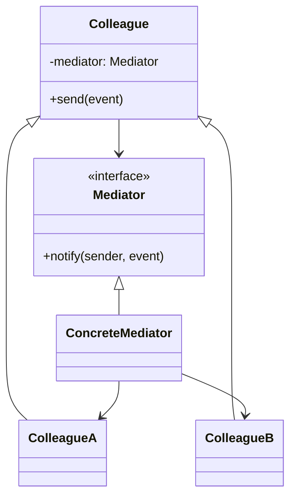
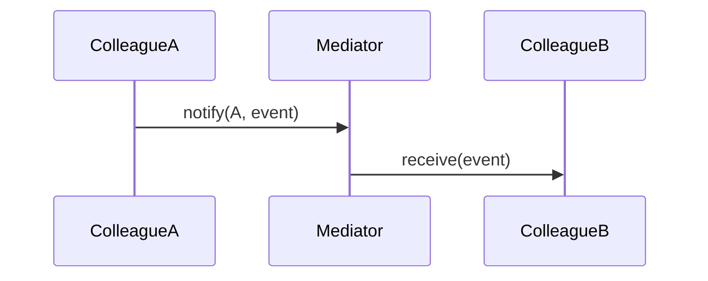

# Mediator Pattern

## 📋 Overview

The **Mediator** pattern defines an object that encapsulates how a set of objects interact. It promotes loose coupling by keeping objects from referring to each other explicitly, and lets you vary their interaction independently.

---

## 🎯 Intent

**Problem Solved:**
- Objects communicate in complex ways
- Direct references create tight coupling
- Communication logic scattered across classes
- Adding new interaction types requires modifications

---

## 👥 Roles & Responsibilities

| Role | Responsibility |
|------|-----------------|
| Mediator | Defines interface for communication |
| ConcreteMediator | Implements interaction logic |
| Colleague | Communicates only with mediator |
- ConcreteColleague | Implements colleague behavior |

---

## 💡 Implementation

- Colleagues reference mediator
- Mediator knows all colleagues
- Communication routed through mediator
- Mediator implements distribution logic

---

## 📊 Class Diagram

---

## 🔄 Sequence Diagram

---

## ⚖️ Trade-offs

### Advantages ✅
- Decouples colleagues
- Centralizes control
- Easy to modify interactions
- Simplifies colleague classes
- Reusable colleagues

### Disadvantages ❌
- Mediator complexity
- God Object risk
- Performance overhead
- Debugging difficulty
- Hidden dependencies

---

## 🌍 Real-World Use Cases

- ChatRoom mediator
- Dialog box coordinators
- Air traffic control
- Central event dispatcher
- Workflow engines

---

## 📚 References

- Gang of Four Design Patterns
- Coordination patterns
