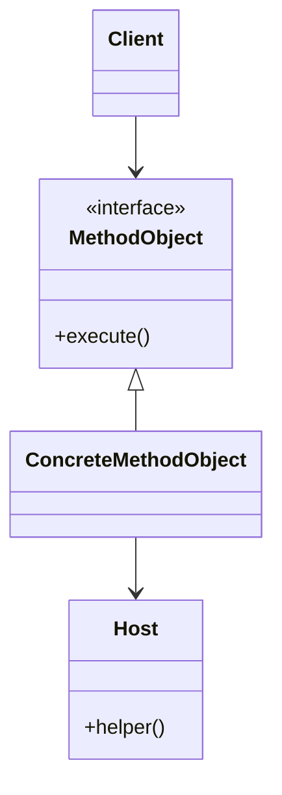
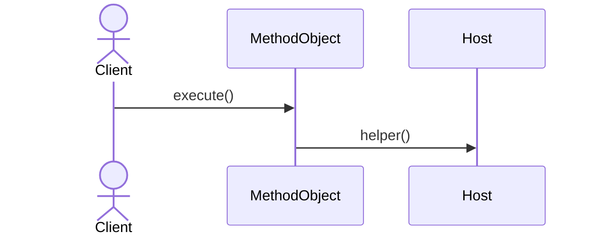

# Method Object Pattern

## 📋 Overview

The **Method Object** pattern converts a method into an object, enabling flexible method parameter passing and invocation.

---

## 🎯 Intent

**Problem Solved:**
- Complex methods with many parameters
- Need to pass methods as parameters
- Deferred method execution
- Method state management

---

## 👥 Roles & Responsibility

- Encapsulate method as object
- Enable method parameter passing
- Manage method state
- Support deferred execution

---

## 📊 Class Diagram

---

## 🔄 Sequence Diagram

---

## 🌍 Real-World Use Cases

- Callback mechanisms
- Command pattern implementation
- Functional programming patterns
- Task queuing systems
- Async operation handlers

---

## 📚 References

- Gang of Four Design Patterns
- Functional programming patterns
