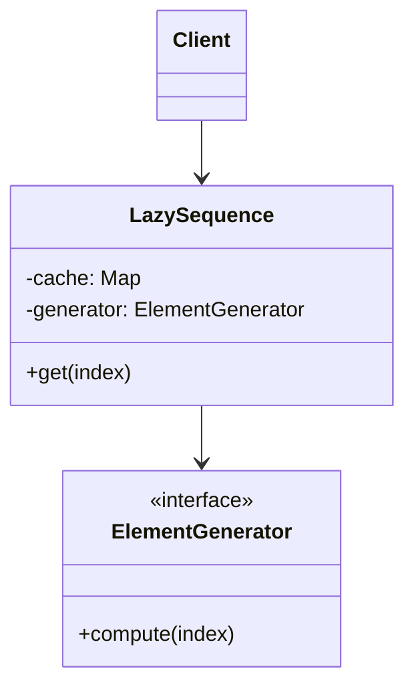
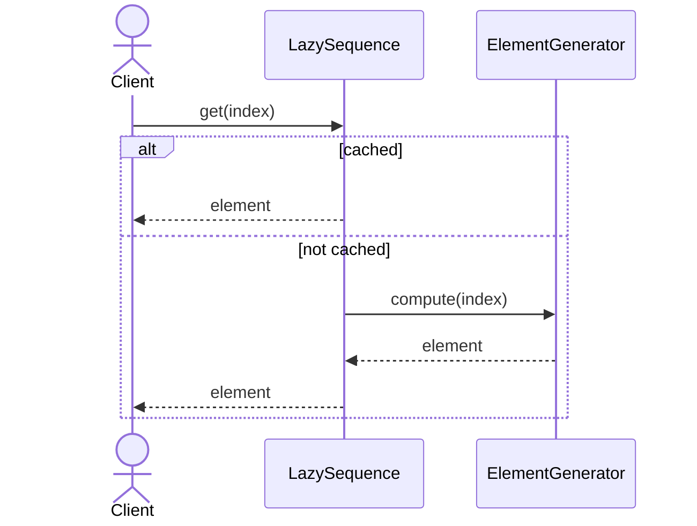

# Lazy Sequence Pattern

## 📋 Overview

The **Lazy Sequence** pattern defers sequence element computation until they're actually accessed, enabling efficient processing of potentially infinite sequences.

---

## 🎯 Intent

**Problem Solved:**
- Defer expensive computations
- Handle potentially infinite sequences
- Support streaming data processing
- Reduce memory usage

---

## 👥 Roles & Responsibilities

| Role | Responsibility |
|------|-----------------|
| LazySequence | Defers element computation |
| ElementGenerator | Generates individual elements |
| Client | Accesses elements on demand |

---

## 💡 Implementation

- Elements computed on first access
- Caching computed results
- Support for infinite sequences
- Memory-efficient processing

---

## 📊 Class Diagram

---

## 🔄 Sequence Diagram

---

## ⚖️ Trade-offs

### Advantages ✅
- Deferred expensive computations
- Memory efficient
- Support infinite sequences
- Streaming processing
- Computation on demand

### Disadvantages ❌
- Harder to understand
- Non-deterministic timing
- Caching overhead
- Debugging complexity
- First-access latency

---

## 🌍 Real-World Use Cases

- Stream API implementations
- Iterator patterns
- Reactive programming
- Data pipeline processing
- Infinite sequence generation

---

## 📚 References

- Lazy evaluation patterns
- Functional programming concepts
- Stream processing
