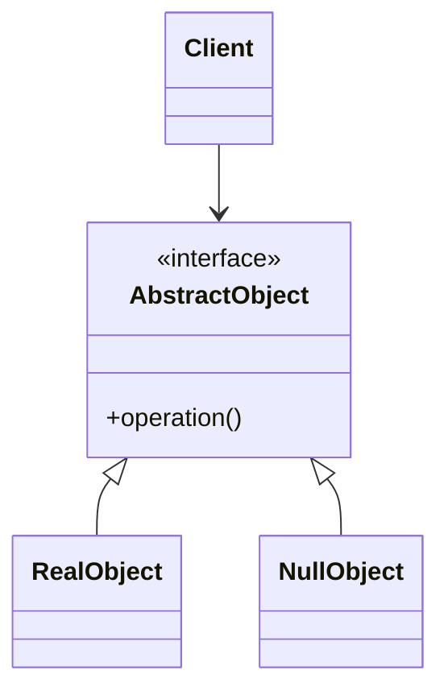
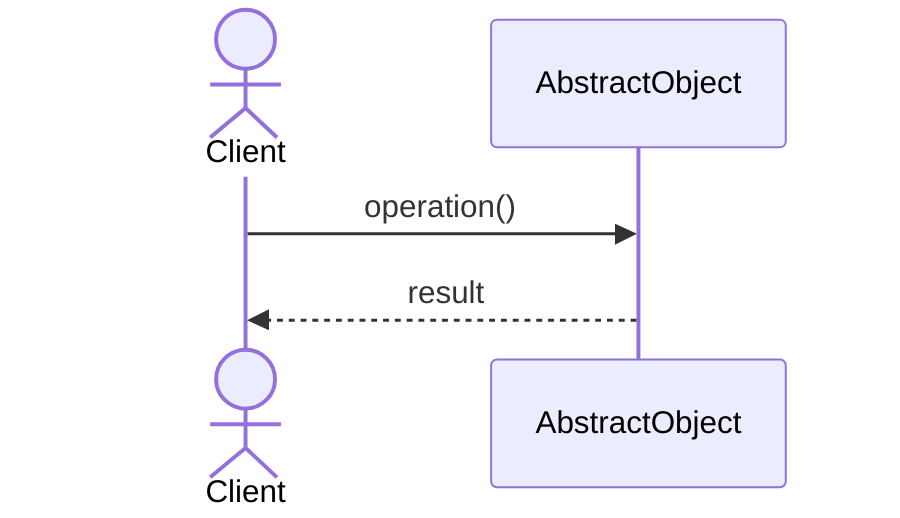

# Null Object Pattern

## 📋 Overview

The **Null Object** pattern provides an object as a surrogate for null references, avoiding null checks throughout the code.

---

## 🎯 Intent

**Problem Solved:**
- Eliminate null reference checks
- Provide default behavior for null case
- Improve code clarity
- Reduce NullPointerException risks

---

## 💡 Implementation

Instead of:
```java
if (logger != null) {
    logger.log("message");
}
```

Use:
```java
logger.log("message");  // Works with NullLogger
```

---

## 📊 Class Diagram



---

## 🔄 Sequence Diagram



---

## ⚖️ Trade-offs

### Advantages ✅
- Eliminates null checks
- Default behavior encapsulated
- Cleaner code
- Safer code
- Visitor pattern support

### Disadvantages ❌
- Silent failures possible
- Harder to detect issues
- Performance overhead
- Over-abstraction risk
- Debugging complexity

---

## 🌍 Real-World Use Cases

- Logging no-op implementations
- Optional services
- Collection empty implementations
- Null object patterns in frameworks

---

## 📚 References

- Null Object pattern
- Optional design
