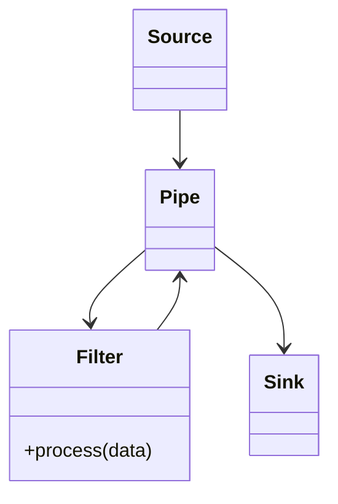
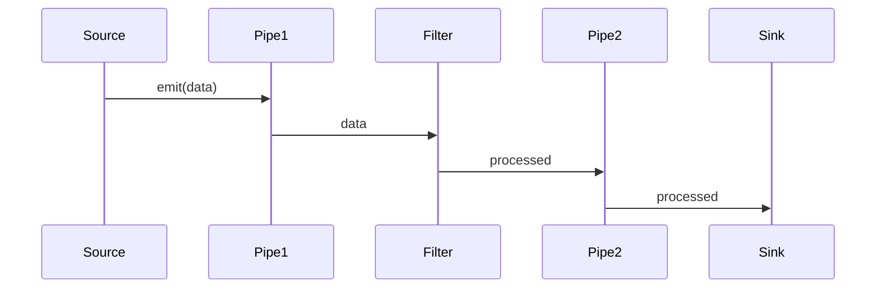

# Pipes and Filters Pattern

## 📋 Overview

The **Pipes and Filters** pattern processes data through a series of independent, modular processing components (filters) connected by data flow channels (pipes).

---

## 🎯 Intent

**Problem Solved:**
- Process complex workflows through independent stages
- Enable modular, reusable components
- Support different processing orders
- Parallel and sequential processing

---

## 👥 Roles & Responsibilities

| Role | Responsibility |
|------|-----------------|
| Filter | Independent processing component |
| Pipe | Data flow channel between filters |
| Source | Produces data |
| Sink | Consumes final result |

---

## 📊 Class Diagram

---

## 🔄 Sequence Diagram

---

## ⚖️ Trade-offs

### Advantages ✅
- Modularity and reusability
- Flexible data processing
- Parallel processing support
- Easy to reconfigure
- Independent testing

### Disadvantages ❌
- Complexity with many filters
- Data transformation overhead
- Error handling complexity
- Debugging difficulty
- Performance considerations

---

## 🌍 Real-World Use Cases

- Unix pipelines
- Data ETL processes
- Image processing pipelines
- Stream processing frameworks
- Log processing

---

## 📚 References

- Enterprise Integration Patterns
- Data pipeline architecture
