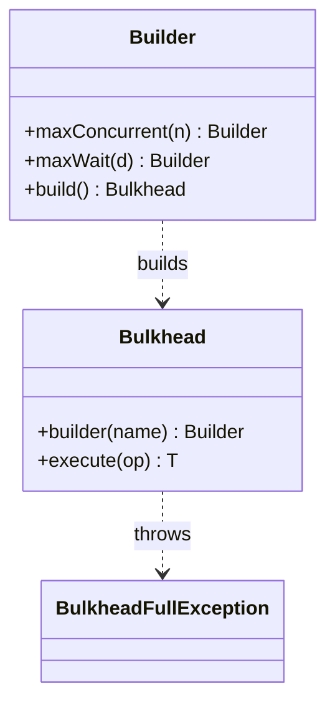
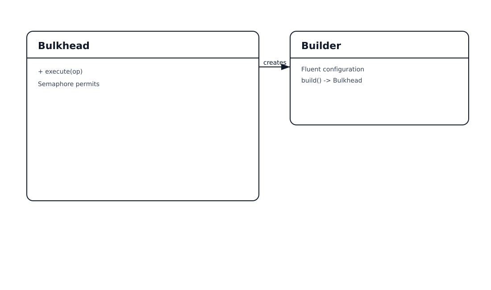

# Bulkhead Pattern

## 📋 Overview

The **Bulkhead** pattern limits concurrency to isolate failures and resource exhaustion. If one dependency becomes slow, it cannot consume all threads/connections.

An example: isolate **inventory** calls so a slow inventory DB does not take down matchmaking.

---

## 💡 Code Example

```java
var bulkhead = Bulkhead.builder("inventory-service")
    .maxConcurrent(5)
    .maxWait(Duration.ofMillis(20))
    .build();

bulkhead.execute(() -> loadInventory(playerId));
```

---

## 📊 Class Diagram





---

## ⚖️ Trade-offs

### Advantages ✅

- Prevents one dependency from exhausting capacity
- Simple mental model (permits)

### Disadvantages ❌

- Needs sizing and separate pools per dependency
