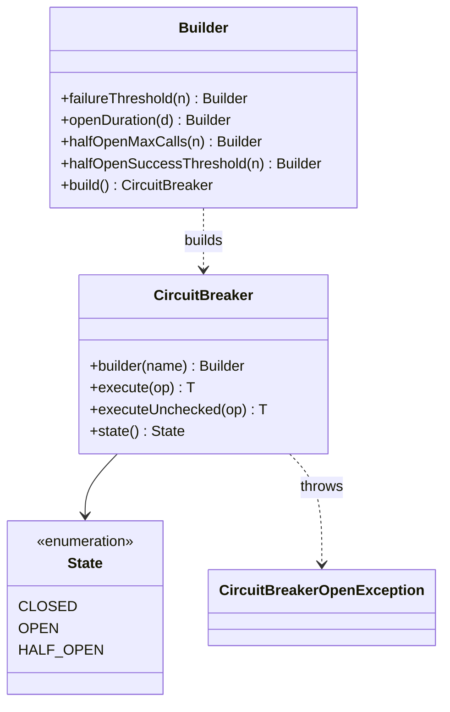
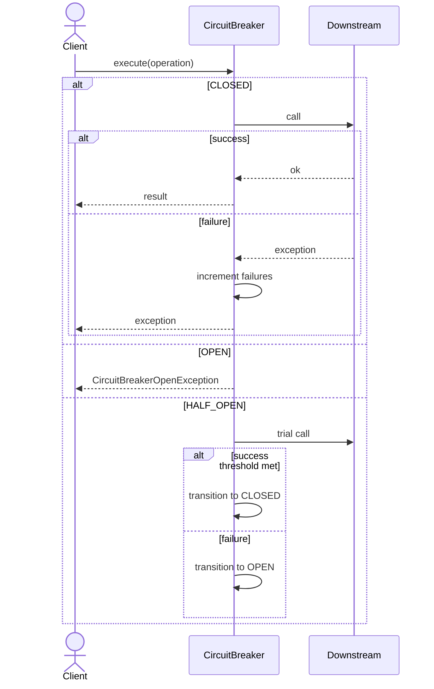

#

# Circuit Breaker Pattern

## 📋 Overview

The **Circuit Breaker** pattern prevents your system from repeatedly calling a failing dependency.
When failures cross a threshold, the breaker **opens** and short-circuits calls for a cool-down period.
After that, it allows limited **trial calls** (half-open) to check whether the dependency recovered.

---

## 🎯 Intent

**Problem Solved:**

- Stop cascading failures when a downstream service is unhealthy
- Reduce load on dependencies during incidents
- Fail fast (and consistently) instead of hanging or retrying endlessly

**Use When:**

- You call remote services, databases, or third-party APIs
- Failures tend to be correlated (outages, overload, rate limits)
- You want controlled recovery behavior after an outage

---

## 👥 Roles & Responsibilities

| Role | Responsibility |
|------|----------------|
| Client | Calls `execute(...)` to run a protected operation |
| CircuitBreaker | Tracks health and blocks/permits calls based on state |
| Downstream | The dependency that may fail (HTTP, DB, etc.) |

---

## 💡 Code Example (Java 21 + Virtual Threads)

```java
var breaker = CircuitBreaker.builder("external-api")
    .failureThreshold(3)
    .openDuration(Duration.ofSeconds(2))
    .halfOpenMaxCalls(1)
    .halfOpenSuccessThreshold(1)
    .build();

try (var executor = Executors.newVirtualThreadPerTaskExecutor()) {
  executor.submit(() -> breaker.executeUnchecked(() -> {
    return callRemoteApi(); // may throw
  }));
}
```

---

## 📊 Class Diagram



---

## 🔄 Sequence Diagram



---

## ⚖️ Trade-offs

### Advantages ✅

- Prevents cascading failures and reduces blast radius
- Gives dependencies time to recover (cool-down)
- Improves latency by failing fast when unhealthy
- Makes recovery behavior explicit and testable

### Disadvantages ❌

- Adds state and tuning parameters (thresholds, timers)
- Wrong settings can cause flapping (open/close too frequently)
- Needs good observability to diagnose and tune

---

## 🚫 When NOT to Use

- For in-process calls where failures are not correlated
- When you cannot tolerate short-circuiting (must always attempt)
- If you cannot operationally monitor and tune it

---

## 📝 Best Practices

1. Start with simple thresholds, then tune with real data
2. Combine with timeouts (a breaker without timeouts is incomplete)
3. Emit metrics (state, opens, rejections, failures, successes)
4. Prefer bounded half-open trials to avoid thundering herds
5. Keep the protected operation small and side-effect aware
