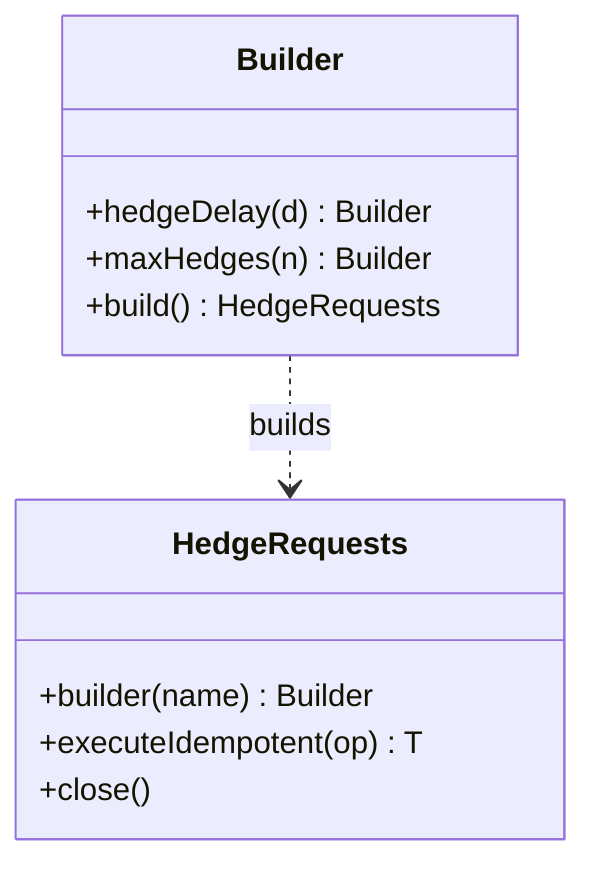
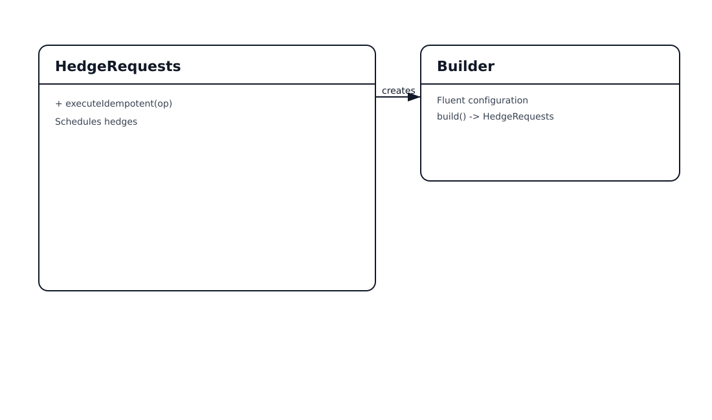

# Hedge Requests Pattern

## 📋 Overview

**Hedging** issues a duplicate request when the primary is slow, returning the first successful response. This reduces tail latency but increases load.

An example: hedge **read-only profile fetches** across replicas.

> Only safe for idempotent reads (or when combined with idempotency keys).

---

## 💡 Code Example

```java
try (var hedger = HedgeRequests.builder("player-profile")
    .hedgeDelay(Duration.ofMillis(20))
    .maxHedges(1)
    .build()) {
  hedger.executeIdempotent(() -> loadProfile(playerId));
}
```

---

## 📊 Class Diagram





---

## ⚖️ Trade-offs

### Advantages ✅
- Reduces tail latency
- Works well for read replicas and caches

### Disadvantages ❌
- Increases load (extra calls)
- Dangerous for non-idempotent operations
