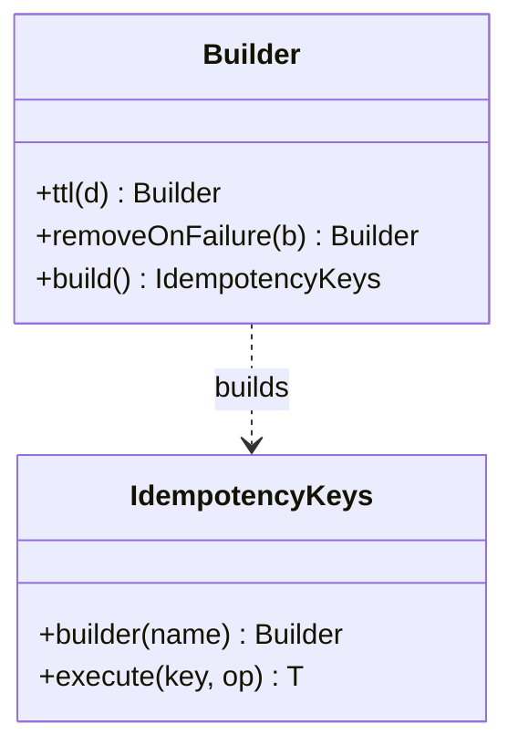
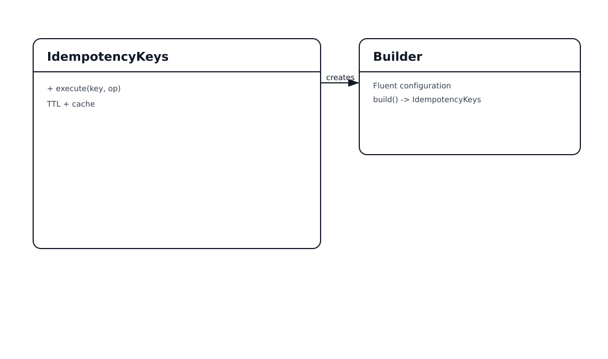

# Idempotency Keys Pattern

## 📋 Overview

**Idempotency keys** ensure that repeated requests with the same key produce the same effect/result, even if the client retries due to timeouts.

An example: prevent double-charging when purchasing in-game currency if the client retries.

---

## 💡 Code Example

```java
var store = IdempotencyKeys.builder("purchase")
    .ttl(Duration.ofMinutes(5))
    .build();

String result = store.execute("purchase:player-42:order-1001", () -> chargeAndGrantCoins());
```

---

## 📊 Class Diagram




