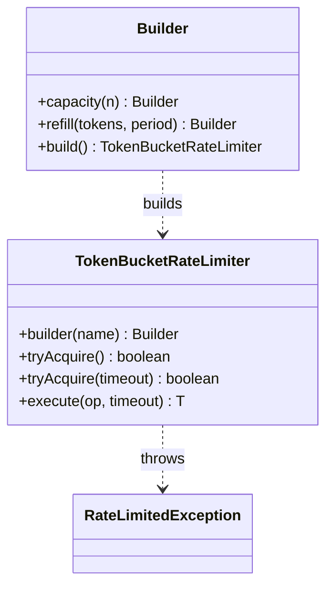
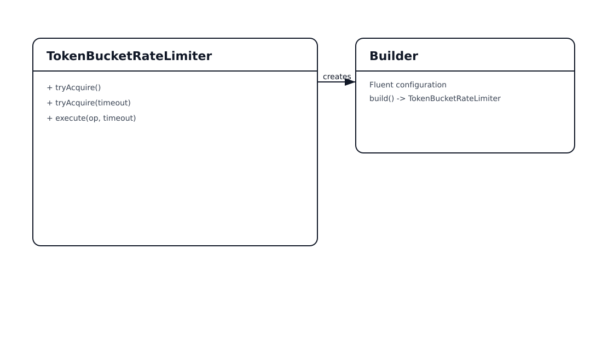
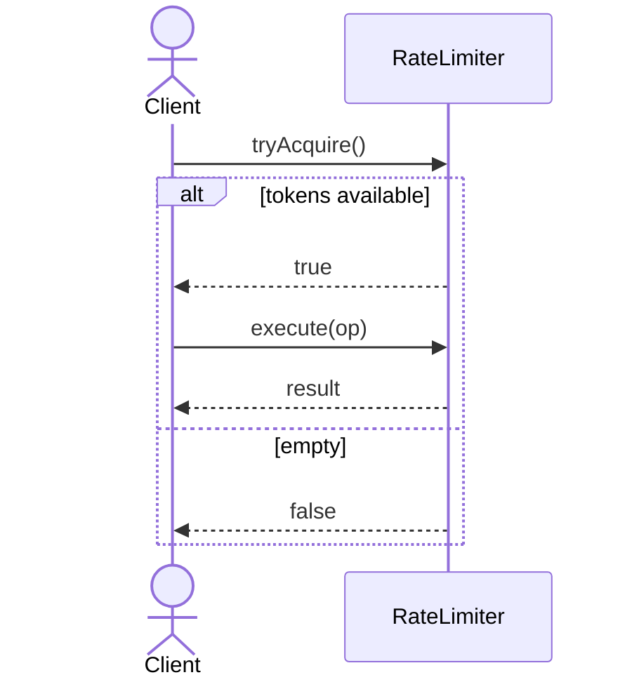

# Rate Limiter Pattern

## 📋 Overview

The **Rate Limiter** pattern controls how frequently an operation is allowed to run. It protects shared resources from spikes and prevents a single client from monopolizing capacity.

An example: limit **leaderboard refresh** or **matchmaking search** calls per player to reduce load.

---

## 🎯 Intent

**Problem Solved:**
- Prevent overload caused by bursts (client retries, bot traffic, thundering herds)
- Enforce fairness per key (player, session, API key, tenant)
- Provide predictable capacity planning and cost control

---

## 💡 Code Example

```java
var limiter = TokenBucketRateLimiter.builder("leaderboard-refresh")
    .capacity(5)
    .refill(5, Duration.ofSeconds(1))
    .build();

limiter.execute(() -> refreshLeaderboard(), Duration.ofMillis(10));
```

---

## 📊 Class Diagram





---

## 🔄 Sequence Diagram



---

## ⚖️ Trade-offs

### Advantages ✅
- Protects systems from bursts and abuse
- Improves fairness across clients
- Reduces tail latency under load

### Disadvantages ❌
- Requires tuning (capacity, refill rate)
- Needs a strategy per-key and storage (in-memory vs distributed)
