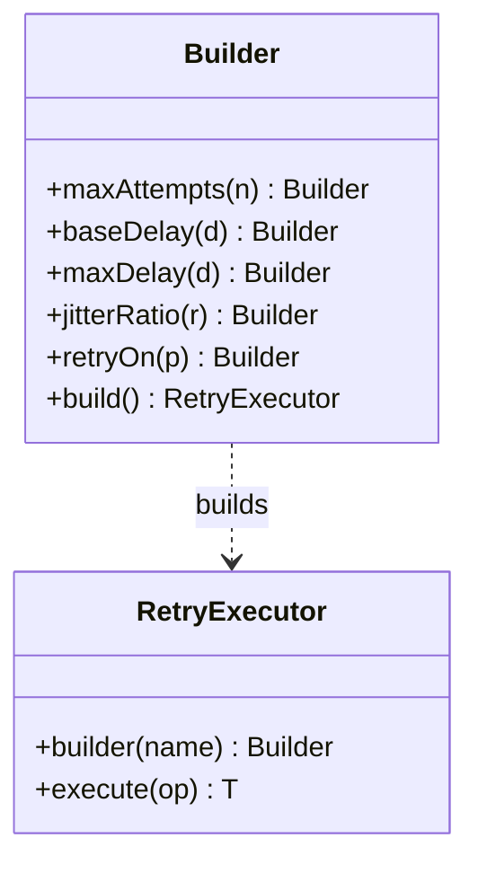

# Retry with Backoff Pattern

## 📋 Overview

**Retry with backoff** retries transient failures while avoiding immediate, synchronized retries that amplify outages.

An example: retry transient **session validation** failures with exponential backoff and jitter.

---

## 💡 Code Example

```java
var retry = RetryExecutor.builder("session-validate")
    .maxAttempts(5)
    .baseDelay(Duration.ofMillis(50))
    .maxDelay(Duration.ofSeconds(1))
    .jitterRatio(0.2)
    .build();

retry.execute(() -> callAuthService());
```

---

## 📊 Class Diagram




---

## ⚖️ Trade-offs

### Advantages ✅
- Recovers from transient failures
- Reduces retry storms via backoff/jitter

### Disadvantages ❌
- Can increase latency if used for non-transient errors
- Needs strict limits (max attempts, max delay)
