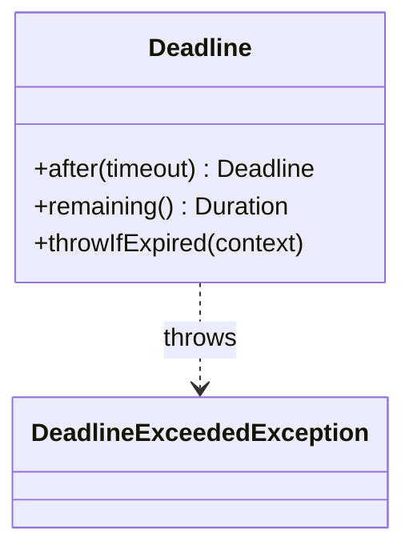
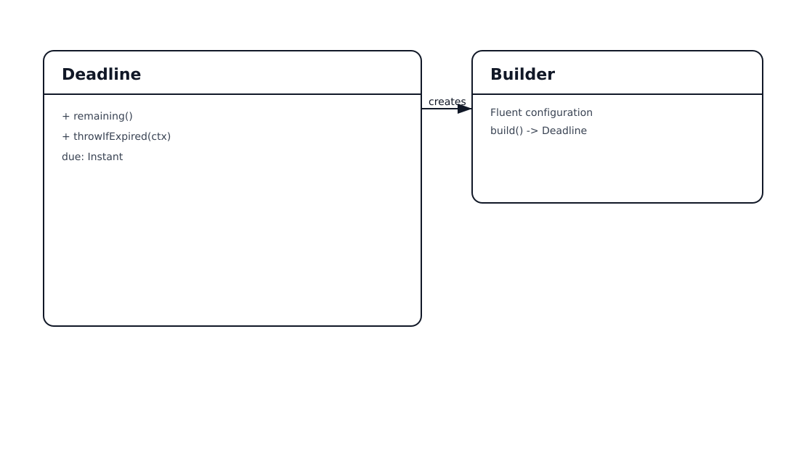

# Timeout & Deadline Propagation Pattern

## 📋 Overview

**Deadline propagation** uses a single end-to-end time budget that is passed to all downstream calls. Each call uses the *remaining* budget so the system fails fast and predictably.

An example: a “join matchmaking” request has a 200ms budget across multiple services.

---

## 💡 Code Example

```java
Deadline deadline = Deadline.after(Duration.ofMillis(200));

deadline.throwIfExpired("pre-check");
callProfile(deadline.remaining());

deadline.throwIfExpired("matchmaking");
callMatchmaking(deadline.remaining());
```

---

## 📊 Class Diagram




