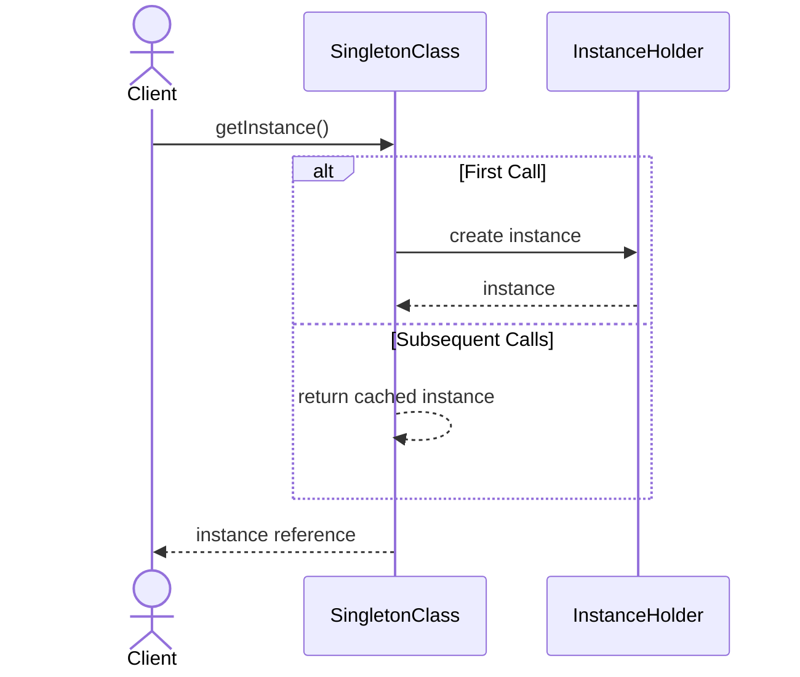
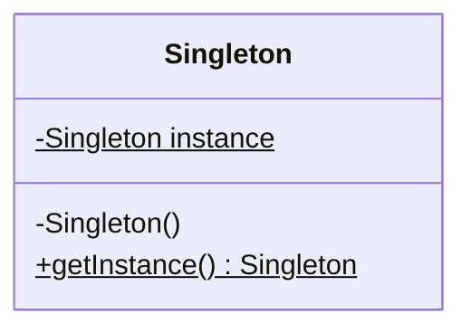

# Singleton Pattern

## 📋 Overview

The **Singleton Pattern** ensures that a class has only one instance and provides a global point of access to it. This is a creational pattern that restricts object instantiation to a single instance while providing a mechanism to access that instance universally.

---

## 🎯 Intent

**Problem Solved:**
- You need to guarantee that only one instance of a class exists throughout the application lifecycle
- Multiple instances would cause logical errors or resource conflicts (e.g., database connections, configuration managers, logging services)
- You need a globally accessible point of access to this single instance without passing references through all layers

**Use When:**
- You need a single, shared resource manager (connection pools, thread pools, caches)
- You need a centralized configuration holder or registry
- You need exactly one instance of a service to coordinate system-wide activities

---

## 👥 Roles & Responsibilities

| Role | Responsibility |
|------|-----------------|
| **Singleton** | Ensures only one instance exists via private constructor; provides static method to access the single instance |
| **Client** | Accesses the singleton instance through the public static accessor method |

**Key Characteristics:**
- Private constructor prevents external instantiation
- Static instance variable holds the single object
- Public static accessor method (`getInstance()`) returns the instance
- Thread-safety considerations for multi-threaded environments

---

## 💡 Implementation Strategies

This pattern has multiple implementations, each with different trade-offs:

### 1. **Eager Initialization**
```java
public class EagerInitializedSingleton {
    private static final EagerInitializedSingleton instance = 
        new EagerInitializedSingleton();
    
    private EagerInitializedSingleton() { }
    
    public static EagerInitializedSingleton getInstance() {
        return instance;
    }
}
```
**Reasoning:** Instance created when class is loaded. Thread-safe by default but allocates memory immediately.

### 2. **Lazy Initialization with Synchronization**
```java
public class ThreadSafeSingleton {
    private static ThreadSafeSingleton instance;
    
    private ThreadSafeSingleton() { }
    
    public static synchronized ThreadSafeSingleton getInstance() {
        if (instance == null) {
            instance = new ThreadSafeSingleton();
        }
        return instance;
    }
}
```
**Reasoning:** Creates instance on first use. Synchronized method ensures thread-safety but causes synchronization overhead on every call.

### 3. **Double-Checked Locking**
```java
public class ThreadSafeSingleton {
    private static ThreadSafeSingleton instance;
    
    private ThreadSafeSingleton() { }
    
    public static ThreadSafeSingleton getInstance() {
        if (instance == null) {
            synchronized (ThreadSafeSingleton.class) {
                if (instance == null) {
                    instance = new ThreadSafeSingleton();
                }
            }
        }
        return instance;
    }
}
```
**Reasoning:** Checks instance twice—once outside lock, once inside. Reduces synchronization overhead while ensuring thread-safety.

### 4. **Bill Pugh Singleton (Class Loader)**
```java
public class BillPughSingleton {
    private BillPughSingleton() { }
    
    private static class SingletonHelper {
        private static final BillPughSingleton instance = 
            new BillPughSingleton();
    }
    
    public static BillPughSingleton getInstance() {
        return SingletonHelper.instance;
    }
}
```
**Reasoning:** Uses inner class to achieve lazy initialization. Thread-safe by design and efficient (no synchronization overhead).

---

## 🔄 Sequence Diagram



---

## 📊 Class Diagram



---

## 🔀 Design Principles Emphasized

| Principle | How Applied |
|-----------|------------|
| **Single Responsibility** | Singleton class has one job: manage the single instance |
| **Dependency Inversion** | Clients depend on the abstraction (interface) rather than concrete class |
| **Separation of Concerns** | Instance management is separated from business logic |
| **Composition over Inheritance** | Rather than subclassing, dependency is injected or accessed via static method |

---

## ⚖️ Trade-offs

### Advantages ✅
- **Global Access:** Provides easy, centralized access to shared resource
- **Controlled Instantiation:** Guarantees exactly one instance exists
- **Lazy Initialization (Option Dependent):** Defers object creation until needed
- **Memory Efficient:** Only one instance in memory
- **Thread-Safe (Option Dependent):** Several implementations are inherently thread-safe

### Disadvantages ❌
- **Testing Difficulty:** Hard to mock for unit tests; global state complicates testing
- **Hidden Dependencies:** Not obvious that code depends on a singleton; dependencies are implicit
- **Synchronization Overhead:** Lock-based implementations add performance cost
- **Violates Single Responsibility:** Often handles both instantiation and business logic
- **Rigid:** Extending or replacing the singleton is difficult without modifying client code
- **Global State:** Makes code less predictable and harder to reason about
- **Concurrency Issues:** Some implementations (eager loading) may fail under specific multi-threaded scenarios

---

## 🚫 When NOT to Use

| Scenario | Why Avoid |
|----------|-----------|
| **Stateful Objects** | Sharing state across all clients leads to unexpected side effects |
| **Testable Systems** | Global dependencies make unit testing extremely difficult |
| **Multiple Instances Needed** | If business logic later requires multiple instances, refactoring is painful |
| **Distributed Systems** | Each JVM/process gets its own instance; doesn't guarantee global uniqueness |
| **Simple Services** | Dependency Injection (DI) containers provide same benefits with better flexibility |

---

## ⚠️ Common Anti-Patterns & Misuses

| Anti-Pattern | Problem | Solution |
|--------------|---------|----------|
| **Mutable Singleton** | Shared state gets corrupted by concurrent modifications | Make singleton immutable or use thread-safe collections |
| **Singleton as Service Locator** | Hides dependencies and couples code to singleton | Use constructor injection instead |
| **Testing Without Mock/Spy** | Tests affect each other via shared state | Provide reset method or use test-specific implementations |
| **Singleton Inheritance** | Each subclass becomes a different singleton | Use composition; wrap the actual singleton |
| **Unnecessary Singletons** | Over-use creates tight coupling | Prefer dependency injection via constructors |
| **Non-Thread-Safe Singleton** | Race conditions in multi-threaded apps | Use double-checked locking or eager initialization |

---

## 🌍 Real-World Use Cases

### Spring Framework
```java
// Spring beans are singletons by default
@Service
public class UserService {
    // Only one instance in Spring Container
}

// Access via Dependency Injection
@Component
public class UserController {
    @Autowired
    private UserService userService;  // Singleton instance injected
}
```

### Log4j / SLF4J
```java
// Logger is typically a singleton
Logger logger = LoggerFactory.getLogger(MyClass.class);
// Returns same logger instance for same class name
```

### Database Connection Pool
```java
// ConnectionPool as singleton to manage all connections
public class ConnectionPool {
    private static final ConnectionPool instance = new ConnectionPool();
    
    public static ConnectionPool getInstance() {
        return instance;
    }
}
```

### Configuration Manager
```java
// Singleton holding application configuration
public class AppConfig {
    private static final AppConfig instance = new AppConfig();
    
    public String getDatabaseUrl() { /* ... */ }
    public int getMaxConnections() { /* ... */ }
}
```

---

## 🔗 Alternatives & Similar Patterns

| Alternative | When to Prefer |
|-------------|-----------------|
| **Dependency Injection** | When using a DI container (Spring, Guice); provides testability and flexibility |
| **Static Class** | For stateless utilities; simpler than singleton but can't implement interfaces |
| **Enum Singleton** | For thread-safety and serialization guarantees in Java |
| **Factory Pattern** | When you need flexibility to create different implementations |
| **Service Locator** | When you need dynamic service registration (though often considered an anti-pattern) |

---

## 📝 Best Practices

1. **Prefer Dependency Injection:** Use DI container (Spring, Guice) instead of manual singleton management
2. **Make Thread-Safe:** Use Bill Pugh Singleton or eager initialization for multi-threaded applications
3. **Document Constraints:** Clearly state that your class is a singleton and why
4. **Provide Test Hooks:** Add methods to reset state for testing
5. **Avoid Mutable State:** Keep singleton data immutable or use thread-safe collections
6. **Consider Enum Singleton:** In Java, `enum` provides the most robust singleton implementation
7. **Avoid as Service Locator:** Don't use singleton to hide dependencies; use dependency injection

---

## 🎓 Related Patterns

- **Factory Pattern:** Often works with Singleton to control creation
- **Lazy Initialization:** Deferring object creation until first use
- **Builder Pattern:** Can be used to construct complex singleton objects
- **Object Pool Pattern:** Similar in controlling limited resources

---

## 📚 References

- Gang of Four Design Patterns
- Effective Java (Joshua Bloch)
- Spring Framework Singleton Scope
- Enum as Singleton in Java
