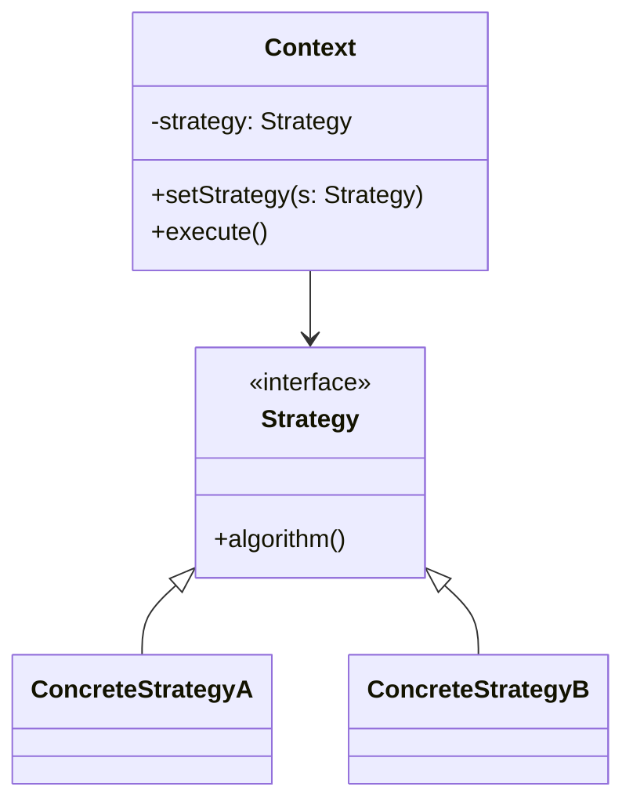
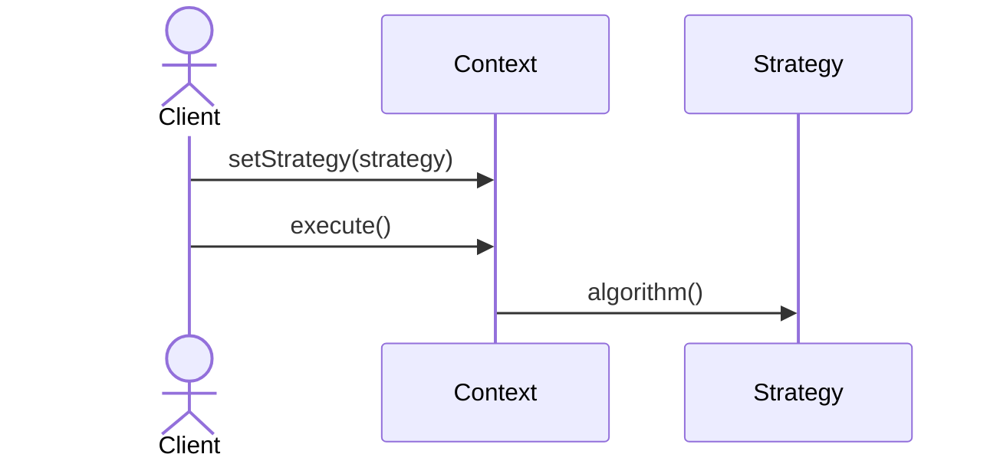

# Strategy Pattern

## 📋 Overview

The **Strategy** pattern defines a family of algorithms, encapsulates each one, and makes them interchangeable.

---

## 🎯 Intent

**Problem Solved:**
- Multiple algorithms for a task
- Algorithm selection varies
- Avoid large conditional statements

---

## 👥 Roles & Responsibilities

| Role | Responsibility |
|------|-----------------|
| Strategy | Defines interface for algorithm |
| ConcreteStrategy | Implements specific algorithm |
| Context | Uses Strategy |

---

## 💡 Code Example

```java
public interface SortStrategy {
    void sort(int[] array);
}

public class Context {
    private SortStrategy strategy;
    
    public void setStrategy(SortStrategy strategy) {
        this.strategy = strategy;
    }
    
    public void executeSort(int[] array) {
        strategy.sort(array);
    }
}

public class QuickSort implements SortStrategy {
    @Override
    public void sort(int[] array) {
        // QuickSort implementation
    }
}

// Usage
Context context = new Context();
context.setStrategy(new QuickSort());
context.executeSort(array);
```

**Reasoning:** Encapsulates algorithms; enables runtime selection; promotes composition.

---

## 📊 Class Diagram



---

## 🔄 Sequence Diagram



---

## ⚖️ Trade-offs

### Advantages ✅
- Encapsulates algorithms
- Runtime algorithm selection
- Eliminates conditionals
- Promotes composition
- Easy to add new strategies

### Disadvantages ❌
- Increased number of classes
- Overhead for simple algorithms
- Client must understand strategies
- Context-strategy coupling
- Strategy selection complexity

---

## 🌍 Real-World Use Cases

- Payment methods
- Compression algorithms
- Sorting algorithms
- Search strategies
- Rendering engines

---

## 📚 References

- Gang of Four Design Patterns
- Algorithm encapsulation
